# 🚀 Comprehensive Guide to Nuxt Content: From Files to Rendered Pages

> **🎯 Master the Art of File-Based Content Management**  
> *A complete educational journey through Nuxt Content's architecture, patterns, and best practices*

---

## 📑 Table of Contents

<details>
<summary><strong>🎯 Click to expand full navigation</strong></summary>

### 🌟 [1. Introduction: The Philosophy of File-Based Content Management](#introduction)
### 📝 [2. YAML vs Markdown: When and Why to Use Each](#yaml-vs-markdown)
   - 📊 [2.1 YAML Files: Structured Data Excellence](#yaml-files)
     - 🔢 [2.1.1 YAML Array Syntax](#yaml-array-syntax)
     - 🏗️ [2.1.2 YAML Object Syntax](#yaml-object-syntax)
   - ✍️ [2.2 Markdown Files: Rich Content with Metadata](#markdown-files)
     - 📋 [2.2.1 Frontmatter: YAML Metadata](#frontmatter-metadata)
     - 📖 [2.2.2 Markdown Rich Content](#markdown-rich-content)
### 🔄 [3. Blog Post Flow: The Complete Journey](#blog-post-flow)
   - 📝 [3.1 Content Creation in Markdown](#step-1-content-creation)
   - ✅ [3.2 Schema Validation with Zod](#step-2-schema-validation)
   - 🛣️ [3.3 Dynamic Route Handling](#step-3-dynamic-route-handling)
     - 🎯 [3.3.1 Route Parameters](#route-parameters)
     - 📡 [3.3.2 Content Fetching](#content-fetching)
     - 🔍 [3.3.3 SEO Configuration](#seo-configuration)
     - 🎨 [3.3.4 Vue Template Rendering](#vue-template-rendering)
   - ⚡ [3.4 ContentRenderer Magic](#step-4-contentrenderer)
### 🏠 [4. Homepage Assembly: Structured Data in Action](#homepage-assembly)
   - 📊 [4.1 Homepage YAML Structure](#homepage-yaml-structure)
   - 🔄 [4.2 Query and Distribution](#query-distribution)
   - 🧩 [4.3 Child Component Implementation](#child-component-implementation)
### 📁 [5. Project Pages: Collections and Iterations](#project-pages)
   - 📋 [5.1 Individual Project Structure](#individual-project-structure)
   - 📊 [5.2 Projects Listing Page](#projects-listing-page)
### 🗃️ [6. Content Queries: The Power of File-Based Databases](#content-queries)
   - 🔍 [6.1 Basic Query Operations](#basic-query-operations)
   - 🎛️ [6.2 Advanced Filtering and Sorting](#advanced-filtering)
   - 🌍 [6.3 Real-World Query Examples](#real-world-queries)
### ✨ [7. Special Features and Advanced Patterns](#special-features)
   - 🧩 [7.1 MDC (Markdown Components)](#mdc-markdown-components)
   - 🎨 [7.2 ContentRenderer Features](#contentrenderer-features)
   - ⚙️ [7.3 Content Transformers](#content-transformers)
   - 🧭 [7.4 Navigation Generation](#navigation-generation)
   - 🔍 [7.5 Search Implementation](#search-implementation)
### 🏗️ [8. Content Architecture Summary](#architecture-summary)
   - 🔄 [8.1 The Complete Flow](#complete-flow)
   - 🎯 [8.2 Key Architectural Decisions](#architectural-decisions)
   - 💡 [8.3 Ideal Use Cases](#ideal-use-cases)

</details>

---

## 🌟 Introduction: The Philosophy of File-Based Content Management {#introduction}

> **🔥 Revolutionary Approach**: Nuxt Content transforms how we think about content management by treating content as **first-class code artifacts**

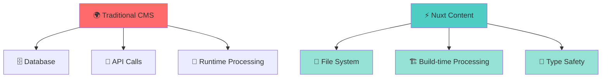

### 🎯 Core Philosophy

| Traditional CMS | 🆚 | Nuxt Content |
|---|---|---|
| 🗄️ Database-driven | ➡️ | 📁 File-based |
| 📡 Runtime API calls | ➡️ | 🏗️ Build-time processing |
| 🔧 Manual type checking | ➡️ | ✅ Automatic type safety |
| 🚀 Separate deployment | ➡️ | 📦 Single deployment unit |

### 💫 Key Benefits

```typescript
// 🔴 Traditional CMS approach (runtime API calls)
const posts = await fetch('https://api.cms.com/posts')
  .then(res => res.json()) // 🐌 Network latency, potential failures

// 🟢 Nuxt Content approach (build-time processing)
const posts = await queryCollection('blog').all() // ⚡ Instant, type-safe, no network
```

> **💡 What did we learn?** Nuxt Content eliminates runtime dependencies by processing content at build time, resulting in faster, more reliable applications with built-in type safety! 🚀

---

## 📝 YAML vs Markdown: When and Why to Use Each {#yaml-vs-markdown}

Understanding when to use YAML versus Markdown is crucial for effective content architecture. Let's explore both approaches with detailed examples and best practices! 🎯

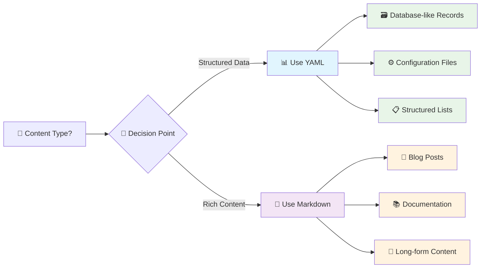

---

## 📊 YAML Files: Structured Data Excellence {#yaml-files}

> **🎯 Perfect for**: Configuration, structured data, and anything that resembles database records

YAML (Yet Another Markup Language) shines when you need:
- 🗃️ **Pure structured data** without prose content
- 🎯 **Consistent field structures** across multiple entries  
- 🤖 **Machine-readable configurations**
- 🏗️ **Complex nested data structures**

### 📋 Real-World Example: Project Entry

**File:** `/content/projects/bloom-finance.yml`

#### 🔢 YAML Array Syntax {#yaml-array-syntax}

```yaml
# 🏷️ Basic project metadata
title: Bloom Finance App Redesign
description: Led the complete UX/UI overhaul of Bloom's mobile banking app
image: https://images.unsplash.com/photo-1551288049-bebda4e38f71
url: "https://bloomfinance.example.com"

# 🔢 YAML Arrays: Dash-Style (Block) Format
tags:                    # 📝 Array declaration
  - "UX Design"         # ➡️ Each item starts with dash + space
  - "UI Design"         # ➡️ Clear visual separation
  - "Mobile App"        # ➡️ Easy to read and edit
  - "Fintech"          # ➡️ Simple to add new items

# 🔢 Alternative: Inline Array Format (less readable)
categories: ["Web App", "B2B", "Finance"]  # 📝 Compact but harder to edit

date: "2024"
status: "completed"      # ✅ Enum-like values
featured: true           # 🔘 Boolean values
```

#### 🏗️ YAML Object Syntax {#yaml-object-syntax}

```yaml
# 🏗️ Nested Object Structures
metrics:                 # 📊 Parent object
  users: "2.5M+"         # ➡️ Key-value pairs
  rating: "4.8/5"        # ➡️ Indentation shows hierarchy
  improvement: "40% increase in user engagement"
  
# 🏗️ Complex Nested Structure
details:
  role: "Lead UX Designer"
  team: "2 Designers, 4 Developers, 1 PM"
  duration: "4 months"
  client: "Bloom Finance Inc"
  
# 🏗️ Arrays of Objects (Most Complex)
highlights:
  - title: "Real-time Data Visualization"          # 📋 Object in array
    description: "Interactive charts for live metrics"
    icon: "i-heroicons-chart-bar"
    impact: "75% faster data processing"
    
  - title: "Customizable Dashboards"              # 📋 Another object
    description: "Personalized views of ESG data"
    icon: "i-heroicons-adjustments-horizontal"
    impact: "200% increase in user engagement"
```

> **💡 What did we learn?** YAML arrays use dash syntax for readability, while objects use indentation to show hierarchy. Complex data structures combine both patterns for maximum flexibility! 🎯

---

## ✍️ Markdown Files: Rich Content with Metadata {#markdown-files}

> **🎯 Perfect for**: Articles, documentation, and any content that needs rich formatting

Markdown excels when you need:
- 📖 **Long-form prose content** (articles, documentation)
- 🎨 **Rich text formatting** (headings, lists, code blocks)
- 🔗 **Metadata + Content** combination (frontmatter + body)
- 👥 **Human-readable and writable** content

### 📖 Real-World Example: Blog Post Structure

**File:** `/content/blog/from-mockup-to-market.md`

#### 📋 Frontmatter: YAML Metadata {#frontmatter-metadata}

```markdown
---
# 📋 FRONTMATTER: YAML metadata section (between --- fences)
title: "From Mockup to Market: My End-to-End Product Design Process"
description: A detailed breakdown of my iterative design methodology
date: 2025-04-23              # 📅 ISO format for consistent sorting
image: https://images.pexels.com/photos/1050312/pexels-photo-1050312.jpeg
minRead: 8                    # ⏱️ Reading time estimation
draft: false                  # 🔘 Visibility control

# 👤 Author information (nested object)
author:
  name: Emma Thompson
  role: "Senior UX Designer"
  avatar:
    src: https://images.unsplash.com/photo-1494790108377-be9c29b29330
    alt: Emma Thompson profile picture

# 🔍 SEO overrides (optional)
seo:
  title: "Color Psychology in UI Design | Emma Thompson"
  description: "Discover how strategic color choices enhance UX..."
  
# 🏷️ Content organization
categories:                   # 📂 Broad categorization
  - Design Process
  - Product Development
tags:                        # 🏷️ Specific keywords
  - UX Design
  - Product Strategy
  - Case Study
---
```

#### 📖 Markdown Rich Content {#markdown-rich-content}

```markdown
<!-- 📖 CONTENT BODY: Rich formatted content begins after closing --- -->

Creating successful digital products isn't about following a rigid formula. It's about understanding your users, iterating based on feedback, and maintaining a clear vision throughout the journey.

## 🔍 Phase 1: Discovery & Research

Every great product starts with understanding the problem. Before I even think about pixels or prototypes, I immerse myself in **user research**:

### 👥 User Interviews
I conduct 15-20 user interviews to understand:
- ❌ Current pain points with existing solutions
- 🧠 Workflows and mental models  
- ✨ Unmet needs and desires
- 🎯 Success criteria and goals

### 📊 Competitive Analysis
```javascript
// 📝 Example: How I structure competitive analysis data
const competitors = {
  direct: ['Product A', 'Product B'],           // 🎯 Direct competitors
  indirect: ['Alternative Solution C'],          // 🔄 Indirect solutions
  features: {
    'Product A': { 
      strength: 'UI', 
      weakness: 'pricing',
      marketShare: '25%' 
    },
    'Product B': { 
      strength: 'features', 
      weakness: 'complexity',
      marketShare: '15%'
    }
  }
}
```

## 🎨 Phase 2: Ideation & Concept Development

With research insights in hand, I move into ideation using structured creativity techniques:

> **💡 Pro Tip**: Use "How Might We" questions to reframe problems as opportunities!

### 🚀 Design Sprint Process
1. **🗓️ Monday**: Map the problem space
2. **🎯 Tuesday**: Sketch solutions individually  
3. **🤝 Wednesday**: Decide on best concepts
4. **🛠️ Thursday**: Build realistic prototype
5. **👥 Friday**: Test with target users

### 🤔 The Philosophy Behind the Choice

| Content Type | 📊 YAML | 📝 Markdown |
|---|---|---|
| **Purpose** | Database records | Articles & documentation |
| **Structure** | Rigid, predictable | Flexible, narrative |
| **Editing** | Field-by-field | Flow-based writing |
| **Output** | Component props | Rendered HTML |
| **Best For** | Projects, testimonials, FAQs | Blog posts, guides, documentation |

> **💡 What did we learn?**
> YAML frontmatter provides structured metadata while Markdown body enables rich content formatting.
> This combination gives you the best of both worlds: structured data AND beautiful prose! ✨

---

## 🔄 Blog Post Flow: The Complete Journey {#blog-post-flow}

Let's trace a blog post's complete journey from markdown source to final rendered page, examining every step with architectural precision! 🎯

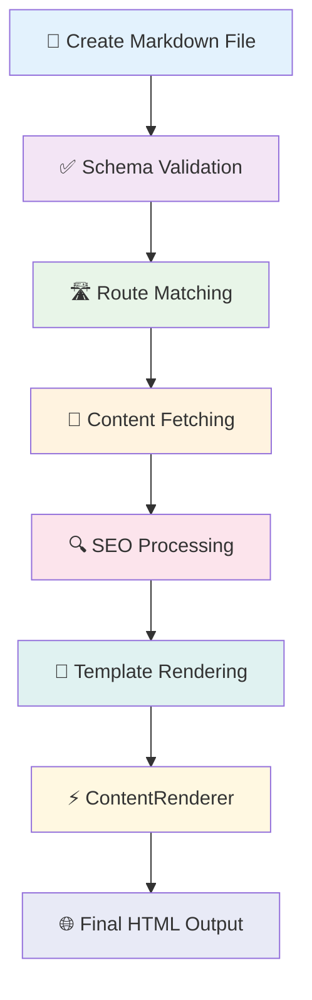

---

## 📝 Step 1: Content Creation in Markdown {#step-1-content-creation}

> **🎯 Goal**: Create rich, structured content with metadata and formatted body text

**File:** `/content/blog/psychology-of-color-in-ui-design.md`

```markdown
---
# 📋 STRUCTURED METADATA (YAML Frontmatter)
title: "The Psychology of Color in UI Design"
description: "How color choices impact user behavior and emotion in digital interfaces"
date: 2025-03-15                    # 📅 ISO format for consistent date handling
image: https://images.pexels.com/photos/1070971/pexels-photo-1070971.jpeg
minRead: 12                         # ⏱️ Helps users gauge time commitment
draft: false                        # 🔘 Content visibility control

# 👤 Author Information
author:
  name: Emma Thompson
  role: "Senior UX Designer"
  avatar:
    src: https://images.unsplash.com/photo-1494790108377-be9c29b29330
    alt: Emma Thompson profile picture

# 🔍 SEO Overrides (optional but powerful)
seo:
  title: "Color Psychology in UI Design | Emma Thompson"
  description: "Discover how strategic color choices can enhance user experience..."
---

<!-- 📖 RICH CONTENT BODY (Markdown formatting) -->

Color is one of the most powerful tools in a UI designer's arsenal. It can evoke emotions, guide attention, and even influence user decisions.

## 🧠 The Science Behind Color Perception

When light hits our retina, it triggers a complex neurological response...

### 🎨 Primary Color Associations
```
```css
/* Continued from above */
/* 💡 Example: Emotional color mapping in CSS */
:root {
  --color-trust: #0066cc;      /* 🔵 Blue: Trust, stability */
  --color-energy: #ff6600;     /* 🟠 Orange: Energy, enthusiasm */
  --color-growth: #00aa00;     /* 🟢 Green: Growth, harmony */
  --color-premium: #663399;    /* 🟣 Purple: Luxury, creativity */
}
```
```markdown
<!-- Continued from above -->
## 💼 Practical Applications in UI Design

### 🎯 1. Call-to-Action Buttons

The color of your CTA can significantly impact conversion rates...
```

> **💡 What did we learn?** Blog posts combine YAML frontmatter for structured metadata with Markdown for rich content formatting. This hybrid approach enables both machine-readable data AND beautiful human-readable content! 🎨


## ✅ Step 2: Schema Validation with Zod {#step-2-schema-validation}

> **🎯 Goal**: Ensure content structure consistency and enable TypeScript autocompletion

**File:** `/content.config.ts`

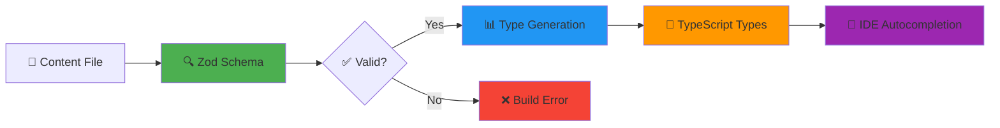

### 🏗️ Collection Definition

```typescript
// 🎯 Define the blog collection with strict typing
export default defineContentConfig({
  collections: {
    blog: defineCollection({
      type: 'page',                    // 📄 Page-type collection
      source: 'blog/*.md',             // 🎯 Glob pattern: all .md files in blog/
      schema: z.object({               // ✅ Zod schema for validation & types
```

### 📋 Required Field Validation

```typescript
        // 🔧 REQUIRED FIELDS with comprehensive validation
        title: z.string()
          .min(10, '❌ Title must be at least 10 characters')         // 🔍 SEO: minimum length
          .max(100, '❌ Title must be less than 100 characters'),     // 🔍 SEO: prevent truncation
        
        description: z.string()
          .min(50, '❌ Description needs at least 50 characters')     // 📝 Meta description substance
          .max(200, '❌ Keep description under 200 characters'),      // 🔍 Google truncates ~160 chars
        
        date: z.string()
          .regex(/^\d{4}-\d{2}-\d{2}$/, '❌ Use YYYY-MM-DD format'),  // 📅 ISO format for sorting
        
        image: z.string()
          .url('❌ Image must be a valid URL')                        // 🔗 Validate URL format
          .refine(
            (url) => url.match(/\.(jpg|jpeg|png|webp)$/i),            // 🖼️ Only image formats
            '❌ Use jpg, png, or webp images only'
          ),
        
        minRead: z.number()
          .int()                                                      // 🔢 Whole numbers only
          .positive()                                                 // ➕ No negative times
          .max(60, '❌ Reading time should be under 60 minutes'),    // ⏱️ Reasonable limit
```

### 🎛️ Optional Fields and Nested Objects

```typescript
        // 🔧 OPTIONAL FIELDS with sensible defaults
        draft: z.boolean().default(false),                           // 📝 Published by default
        
        // 👤 NESTED OBJECT: Author information
        author: z.object({
          name: z.string(),                                         // ✅ Required: author name
          role: z.string().optional(),                              // 💼 Optional: job title
          avatar: z.object({                                        // 🖼️ Optional: profile image
            src: z.string().url(),                                  // 🔗 Must be valid URL
            alt: z.string()                                         // ♿ Accessibility: alt text required
          }).optional()
        }),
        
        // 🔍 SEO OVERRIDES - optional but structured
        seo: z.object({
          title: z.string().optional(),                             // 📝 Custom page title
          description: z.string().optional(),                       // 📝 Custom meta description
          image: z.string().url().optional()                        // 🖼️ Custom social image
        }).optional(),
        
        // 🏷️ TAXONOMIES for content organization
        categories: z.array(z.string()).optional(),                 // 📂 Content categories
        tags: z.array(z.string()).optional()                        // 🏷️ Content tags
      })
    })
  }
})
```

> **💡 What did we learn?** Zod schemas provide compile-time type safety AND runtime validation! They catch content errors early, ensure consistent structure, and enable amazing TypeScript autocompletion throughout your app. It's like having a helpful assistant checking your content! 🤖✨

---

## 🛣️ Step 3: Dynamic Route Handling {#step-3-dynamic-route-handling}

> **🎯 Goal**: Handle dynamic blog routes and fetch the correct content for each URL

**File:** `/app/pages/blog/[...slug].vue`

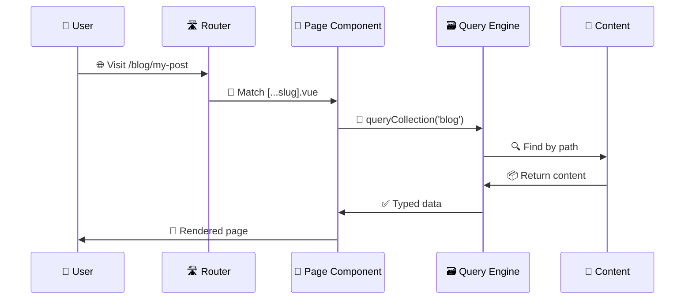

### 🎯 Route Parameters and Path Matching {#route-parameters}

```vue
<script setup lang="ts">
import type { BlogCollectionItem } from '@nuxt/content'

// 🛣️ ROUTE HANDLING
// useRoute() gives us access to current route information
const route = useRoute()

// 📝 The [...slug] pattern captures ALL segments after /blog/
// Example URL: /blog/psychology-of-color-in-ui-design
// ➡️ route.params.slug = ['psychology-of-color-in-ui-design']
// ➡️ route.path = '/blog/psychology-of-color-in-ui-design'
```

### 📡 Content Fetching with useAsyncData {#content-fetching}

```vue
// 📡 CONTENT FETCHING
// useAsyncData provides SSR-compatible data fetching with built-in caching
const { data: page, error } = await useAsyncData(
  route.path,                        // 🗝️ Cache key - unique per route
  () => queryCollection('blog')      // 🗃️ Query the blog collection
    .path(route.path)                // 🎯 Match content by exact path
    .first()                         // 📄 Get single item (not array)
)

// 🚨 404 HANDLING - content not found
if (!page.value) {
  throw createError({
    statusCode: 404,
    statusMessage: '❌ Blog post not found'
  })
}

// 🧭 NAVIGATION DATA for prev/next links
const { data: surround } = await useAsyncData(
  `${route.path}-surround`,          // 🗝️ Unique cache key for navigation
  () => queryCollectionItemSurroundings(
    'blog',                          // 📚 Collection name
    route.path,                      // 📍 Current item path
    {
      fields: ['title', 'description', 'date'], // ⚡ Only fetch needed fields (performance!)
      where: {
        draft: { $ne: true }         // 🚫 Exclude draft posts from navigation
      }
    }
  )
)
```

### 🔍 SEO Configuration {#seo-configuration}

```vue
// 🔍 SEO CONFIGURATION
// Set meta tags for search engines and social sharing
useSeoMeta({
  // 📝 Title pattern: "Post Title | Site Name"
  title: page.value.seo?.title || `${page.value.title} | Emma Thompson`,
  
  // 📄 Use SEO description if provided, otherwise use post description
  description: page.value.seo?.description || page.value.description,
  
  // 📱 OPEN GRAPH tags for social media sharing
  ogTitle: page.value.seo?.title || page.value.title,
  ogDescription: page.value.seo?.description || page.value.description,
  ogType: 'article',                 // 📰 Tells platforms this is an article
  
  // 📰 ARTICLE-SPECIFIC meta tags for rich snippets
  articleAuthor: page.value.author.name,
  articlePublishedTime: page.value.date,
  articleSection: page.value.categories?.[0] || 'Design',
  articleTag: page.value.tags?.join(', '),
  
  // 🐦 TWITTER CARD configuration
  twitterCard: 'summary_large_image',  // 🖼️ Large image format for Twitter
  twitterCreator: '@emmathompson'      // 👤 Author's Twitter handle
})

// 🖼️ Set Open Graph image if available
if (page.value.image) {
  defineOgImage({ 
    url: page.value.image,
    width: 1200,                     // 📐 Optimal OG width (Facebook/Twitter)
    height: 630,                     // 📐 Optimal OG height (1.91:1 ratio)
    alt: page.value.title
  })
}
```

### 🎛️ Computed Properties and Reactivity

```vue
// 🎛️ COMPUTED PROPERTIES
// Format date for human-readable display
const formatDate = (dateString: string) => {
  const date = new Date(dateString)
  return new Intl.DateTimeFormat('en-US', {
    year: 'numeric',
    month: 'long',                   // ✨ "January" instead of "01"
    day: 'numeric'
  }).format(date)
}

// 🆕 Check if post is recent (less than 30 days old)
const isRecent = computed(() => {
  const postDate = new Date(page.value.date)
  const thirtyDaysAgo = new Date()
  thirtyDaysAgo.setDate(thirtyDaysAgo.getDate() - 30)
  return postDate > thirtyDaysAgo   // 🔘 Returns boolean for conditional rendering
})

// 📊 READING PROGRESS tracking for progress bar
const { y: scrollY } = useWindowScroll()        // 📏 Current scroll position
const { height: windowHeight } = useWindowSize() // 📐 Viewport height

const readingProgress = computed(() => {
  if (!process.client) return 0                 // 🛡️ SSR safety check
  const docHeight = document.documentElement.scrollHeight  // 📏 Total page height
  const progress = (scrollY.value / (docHeight - windowHeight.value)) * 100
  return Math.min(100, Math.max(0, progress))   // 🎯 Clamp between 0-100%
})
</script>
```

### 🎨 Vue Template Rendering {#vue-template-rendering}

```vue
<template>
  <!-- 🏠 Main container with consistent spacing -->
  <UMain class="mt-20 px-2">
    <!-- 📊 Reading progress bar (fixed position) -->
    <div 
      class="fixed top-0 left-0 h-1 bg-primary transition-all duration-300 z-50"
      :style="{ width: `${readingProgress}%` }"  <!-- 🎯 Reactive width -->
    />
    
    <!-- 📦 Container with max width for readability -->
    <UContainer class="relative min-h-screen">
      <!-- ✅ Only render if page data is loaded -->
      <UPage v-if="page">
        
        <!-- 📋 Article metadata bar -->
        <div class="flex text-xs text-muted items-center justify-center gap-4 mb-6">
          <!-- 🆕 Recent badge for new posts -->
          <span 
            v-if="isRecent"                      <!-- 🎛️ Computed property -->
            class="bg-primary/10 text-primary px-2 py-1 rounded-full"
          >
            ✨ NEW
          </span>
          
          <!-- 📅 Publication date (formatted) -->
          <span>{{ formatDate(page.date) }}</span>
          
          <!-- 🔹 Visual separator -->
          <span class="text-muted/50">•</span>
          
          <!-- ⏱️ Reading time estimate -->
          <span>📖 {{ page.minRead }} MIN READ</span>
          
          <!-- 📂 First category if available -->
          <template v-if="page.categories?.length">
            <span class="text-muted/50">•</span>
            <span class="text-primary">🏷️ {{ page.categories[0] }}</span>
          </template>
        </div>
        
        <!-- 🖼️ Hero image with aspect ratio -->
        <div class="relative aspect-[16/9] mb-8">
          <NuxtImg
            :src="page.image"                    <!-- 📝 From frontmatter -->
            :alt="page.title"                    <!-- ♿ Accessibility -->
            class="rounded-lg w-full h-full object-cover"
            loading="eager"                      <!-- ⚡ Load immediately for LCP -->
            sizes="100vw"                        <!-- 📱 Full viewport width -->
            :modifiers="{ 
              quality: 90,                       <!-- 🎯 High quality -->
              format: 'webp'                     <!-- 📦 Modern format -->
            }"
          />
        </div>
        
        <!-- 📖 Article header (centered layout) -->
        <header class="text-center mb-12">
          <!-- 🎯 Main title with responsive sizing -->
          <h1 class="text-4xl md:text-5xl font-bold mb-4 leading-tight">
            {{ page.title }}
          </h1>
          
          <!-- 📝 Description/subtitle -->
          <p class="text-lg text-muted max-w-2xl mx-auto">
            {{ page.description }}
          </p>
        </header>
        
        <!-- 👤 Author information (centered) -->
        <div class="flex justify-center mb-12">
          <UUser
            orientation="vertical"              <!-- 📚 Stack avatar above name -->
            :name="page.author.name"
            :role="page.author.role"
            :avatar="page.author.avatar"
            class="text-center"
          />
        </div>
        
        <!-- 📖 Article body with prose styling -->
        <UPageBody class="max-w-3xl mx-auto">
          <!-- ⚡ ContentRenderer handles markdown → HTML conversion -->
          <ContentRenderer
            v-if="page.body"                    <!-- ✅ Only render if body exists -->
            :value="page"                       <!-- 📦 Pass entire page object -->
            class="prose prose-lg"              <!-- 🎨 Tailwind typography -->
          />
        </UPageBody>
        
        <!-- 🏷️ Tag list (if tags exist) -->
        <div 
          v-if="page.tags?.length" 
          class="flex flex-wrap gap-2 justify-center mt-12"
        >
          <span
            v-for="tag in page.tags"            <!-- 🔄 Loop through tags -->
            :key="tag"                          <!-- 🗝️ Unique key for Vue -->
            class="px-3 py-1 bg-muted/10 rounded-full text-sm"
          >
            #{{ tag }}                          <!-- 🏷️ Hash prefix -->
          </span>
        </div>
        
        <!-- 🧭 Navigation between posts -->
        <nav 
          v-if="surround?.prev || surround?.next"
          class="mt-16 pt-8 border-t border-muted/20"
        >
          <div class="grid md:grid-cols-2 gap-8">
            
            <!-- ⬅️ Previous post link -->
            <NuxtLink
              v-if="surround.prev"
              :to="surround.prev.path"
              class="group p-6 rounded-lg border hover:border-primary transition-colors"
            >
              <div class="text-sm text-muted mb-2">← Previous</div>
              <h3 class="font-semibold group-hover:text-primary transition-colors">
                {{ surround.prev.title }}
              </h3>
              <p class="text-sm text-muted mt-2 line-clamp-2">
                {{ surround.prev.description }}
              </p>
            </NuxtLink>
            
            <!-- 📍 Empty space if no previous post -->
            <div v-else />
            
            <!-- ➡️ Next post link -->
            <NuxtLink
              v-if="surround.next"
              :to="surround.next.path"
              class="group p-6 rounded-lg border hover:border-primary transition-colors text-right"
            >
              <div class="text-sm text-muted mb-2">Next →</div>
              <h3 class="font-semibold group-hover:text-primary transition-colors">
                {{ surround.next.title }}
              </h3>
              <p class="text-sm text-muted mt-2 line-clamp-2">
                {{ surround.next.description }}
              </p>
            </NuxtLink>
          </div>
        </nav>
      </UPage>
    </UContainer>
  </UMain>
</template>
```

> **🎨 What did we learn?** The Vue template uses reactive data binding, conditional rendering, and responsive design patterns. It demonstrates how frontmatter data flows seamlessly into components and how user interactions (like scrolling) trigger reactive updates in real-time! ✨

---

## ⚡ Step 4: ContentRenderer Magic {#step-4-contentrenderer}

> **🎯 Goal**: Transform markdown content into beautiful, interactive HTML with syntax highlighting and component support

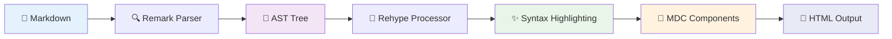

### 🔄 ContentRenderer Transformations

```typescript
// ⚡ Under the hood, ContentRenderer performs these transformations:

// 1️⃣ MARKDOWN PARSING
// Uses remark/rehype pipeline to parse markdown AST (Abstract Syntax Tree)
markdown → AST → HTML

// 2️⃣ SYNTAX HIGHLIGHTING  
// Applies Shiki/Prism for code block highlighting with theme support

// 3️⃣ MARKDOWN → HTML TRANSFORMATIONS
"# Heading"           → <h1>Heading</h1>                    // 📰 Headers
"**bold text**"       → <strong>bold text</strong>          // 💪 Bold formatting
"*italic text*"       → <em>italic text</em>                // ✨ Italic formatting  
"[link text](url)"    → <a href="url">link text</a>        // 🔗 Links

// 4️⃣ CODE BLOCK TRANSFORMATIONS
"```js\nconsole.log('hi')\n```" → 
`<pre><code class="language-js">console.log('hi')</code></pre>`

// 5️⃣ MDC COMPONENT SUPPORT
"::alert{type='info'}\nContent\n::" → 
`<Alert type="info">Content</Alert>`                      // 🧩 Vue components in markdown

// 6️⃣ PROSE STYLING
// Applies Tailwind Typography classes for beautiful, readable formatting
// Handles lists, blockquotes, tables, and responsive typography
```

> **⚡ What did we learn?** ContentRenderer is the bridge between markdown and Vue! It transforms text into styled HTML while supporting Vue components, syntax highlighting, and responsive typography—all automatically! It's like having a super-powered markdown processor! 🚀

---

## 🏠 Homepage Assembly: Structured Data in Action {#homepage-assembly}

The homepage demonstrates how YAML structured data flows through components like a well-orchestrated symphony! 🎼✨

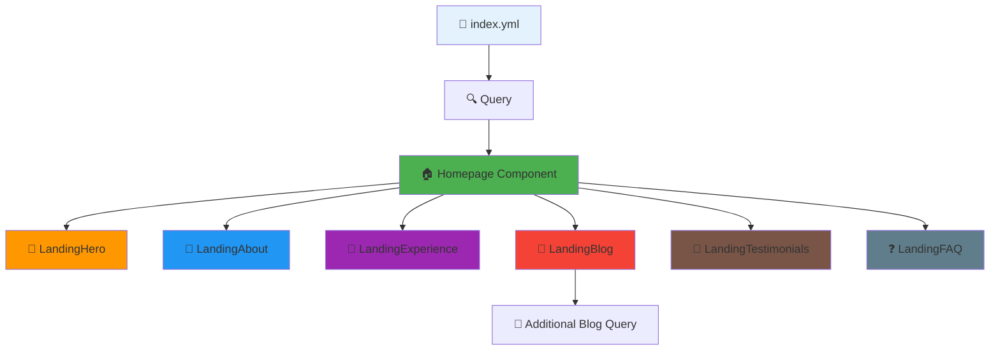

---

## 📊 Step 1: Homepage YAML Structure {#homepage-yaml-structure}

**File:** `/content/index.yml`

### 🔍 SEO and Page Metadata

```yaml
# 🔍 SEO metadata - consumed by useSeoMeta() in pages/index.vue
seo:
  title: "Emma Thompson - UX/UI Designer"                      # 📝 Custom page title
  description: "Welcome to my portfolio. I craft intuitive digital experiences..."  # 📄 Meta description
  image: "https://emmathompson.design/og-image.jpg"           # 🖼️ Social sharing image

# 🏠 Page-level metadata for hero component
title: "Hey, I'm Emma Thompson UX/UI Designer"                # 🎯 Main heading
description: "I craft intuitive digital experiences that delight users and drive business results."  # 📝 Subtitle
```

### 🎨 Hero Section Configuration

```yaml
# 🎨 Hero section configuration - consumed by LandingHero component
hero:
  # 🎯 Call-to-action buttons array
  links:
    - label: "Use this template"                             # 🏷️ Button text
      to: https://github.com/nuxt-ui-pro/portfolio            # 🔗 External URL
      color: "neutral"                                       # 🎨 UI color theme
      variant: "solid"                                       # 🎛️ Button style
      external: true                                         # 🚀 Opens in new tab
      icon: "i-heroicons-arrow-top-right-on-square"         # 🎯 Iconify icon
    
    - label: "View my work"                                 # 🎨 Second button
      to: "#projects"                                        # ⚓ Anchor link
      color: "primary"                                       # 🎨 Primary color
      variant: "ghost"                                       # 👻 Ghost style
      smooth: true                                           # ✨ Smooth scroll
  
  # 🖼️ Hero image carousel array
  images:
    - src: https://picsum.photos/468/468?random=1           # 🖼️ Placeholder image
      alt: "UI Design Project 1"                            # ♿ Accessibility text
      caption: "Bloom Finance App"                           # 📝 Image caption
    - src: https://picsum.photos/468/468?random=2
      alt: "UX Research Process"
      caption: "User Research Session"
    - src: https://picsum.photos/468/468?random=3
      alt: "Design System Components"
      caption: "Component Library"
```

### 📖 About Section with Multi-line Content

```yaml
# 📖 About section content - consumed by LandingAbout component
about:
  title: "About Me"                                          # 📝 Section heading
  image:
    src: "https://images.unsplash.com/photo-1580489944761-15a19d654956"  # 👤 Profile image
    alt: "Emma Thompson"                                     # ♿ Alt text
  
  # 📝 Multi-line content using | (literal scalar - preserves line breaks)
  description: |
    As a UX/UI designer and front-end developer with over 8 years of experience, 
    I bridge the gap between design and development to create seamless digital experiences.
    
    My approach combines user-centered design principles with technical implementation 
    knowledge, ensuring that beautiful designs are also practical and performant.
  
  # 🎯 Nested skill categories
  skills:
    design:                                                 # 🎨 Skill category key
      title: "Design Skills"                                # 📝 Category display name
      items:                                                # 📋 Array of skills
        - "User Research & Testing"
        - "Information Architecture"
        - "Interaction Design"
        - "Visual Design"
        - "Design Systems"
    
    development:                                            # 💻 Second category
      title: "Development Skills"
      items:
        - "HTML/CSS/JavaScript"
        - "Vue.js & Nuxt"
        - "React & Next.js"
        - "Tailwind CSS"
        - "Git & CI/CD"
```

### 💼 Work Experience Timeline

```yaml
# 💼 Work experience timeline - consumed by LandingWorkExperience component
experience:
  title: "Work Experience"                                   # 📝 Section title
  items:                                                    # 📋 Array of positions
    - position: "Senior Product Designer"                   # 💼 Job title
      date: "2023 - Present"                                # 📅 Duration
      company:
        name: Nuxt                                          # 🏢 Company name
        logo: "i-simple-icons-nuxtdotjs"                    # 🎯 Iconify icon
        url: "https://nuxt.com"                             # 🔗 Company website
        color: "#00DC82"                                    # 🎨 Brand color
      description: "Leading design for Nuxt UI Pro component library and Nuxt Studio."
      achievements:                                         # 🏆 Array of accomplishments
        - "Designed 50+ production-ready components"
        - "Increased developer adoption by 200%"
        - "Built comprehensive design system"
    
    - position: "UX/UI Designer"                           # 💼 Second position
      date: "2020 - 2023"
      company:
        name: TechStartup Inc
        logo: "i-heroicons-rocket-launch"                   # 🚀 Different icon type
        url: "https://techstartup.example"
        color: "#3B82F6"                                    # 🔵 Blue brand color
      description: "Redesigned the entire product suite for better user engagement."
      achievements:
        - "Reduced user onboarding time by 60%"
        - "Improved task completion rate by 45%"
        - "Led design for 3 major product launches"
```

### 🔄 Dynamic Sections (Blog, Testimonials, FAQ)

```yaml
# 📝 Blog section configuration - consumed by LandingBlog component
blog:
  title: "Latest Articles"                                  # 📝 Section heading
  description: "Thoughts on design, development, and building great products"  # 📄 Subtitle
  link:                                                     # 🔗 "View all" link
    label: "View all articles"                             # 🏷️ Link text
    to: "/blog"                                             # 🎯 Target route

# 💬 Testimonials section - consumed by LandingTestimonials component
testimonials:
  title: "What People Say"                                 # 📝 Section heading
  description: "Feedback from colleagues and clients I've worked with"
  items:                                                    # 📋 Array of testimonials
    - name: "Sarah Chen"                                    # 👤 Author name
      role: "Product Manager at Nuxt"                      # 💼 Author role
      avatar:
        src: "https://images.unsplash.com/photo-1438761681033-6461ffad8d80"  # 👤 Profile image
        alt: "Sarah Chen"                                  # ♿ Alt text
      # 💬 Quote content using > (folded scalar - joins lines)
      content: >
        Emma's ability to translate complex user needs into elegant design 
        solutions is remarkable. She doesn't just design interfaces; she 
        crafts experiences that users love.
      # 🏢 Social proof
      company:
        name: "Nuxt"                                        # 🏢 Company validation
        logo: "i-simple-icons-nuxtdotjs"                    # 🎯 Company logo
    
    - name: "Michael Rodriguez"                            # 👤 Second testimonial
      role: "Engineering Lead"
      avatar:
        src: "https://images.unsplash.com/photo-1472099645785-5658abf4ff4e"
        alt: "Michael Rodriguez"
      content: >
        Working with Emma is a developer's dream. Her designs are not only 
        beautiful but also implementable, with careful consideration for 
        performance and accessibility.
      rating: 5                                             # ⭐ Star rating (1-5)

# ❓ FAQ section - consumed by LandingFAQ component
faq:
  title: "Frequently Asked Questions"                       # 📝 Section heading
  description: "Common questions about my work and process"
  items:                                                    # 📋 Array of Q&A pairs
    - question: "What's your design process?"              # ❓ Question text
      answer: >                                             # 💡 Answer (folded scalar)
        I follow a user-centered design process that includes research, 
        ideation, prototyping, testing, and iteration. Each project starts 
        with understanding user needs and business goals.
    
    - question: "Do you code your designs?"
      answer: >
        Yes! I believe designers who can code create more practical and 
        implementable solutions. I regularly code prototypes and contribute 
        to production codebases.
    
    - question: "What tools do you use?"
      answer: >
        For design: Figma, Sketch, and Adobe Creative Suite. 
        For development: VS Code, Vue/Nuxt, React/Next, and Tailwind CSS. 
        For collaboration: Slack, Linear, and GitHub.
```

> **🏗️ What did we learn?** YAML structure mirrors component needs perfectly! Each section (hero, about, experience) has data shaped exactly for its consuming component. Multi-line content uses `|` (literal) or `>` (folded) scalars for different formatting needs! 📊✨

---

## 🔄 Step 2: Query and Distribution {#query-distribution}

**File:** `/app/pages/index.vue`

> **🎯 Goal**: Fetch homepage content from YAML and distribute it to child components with SEO optimization

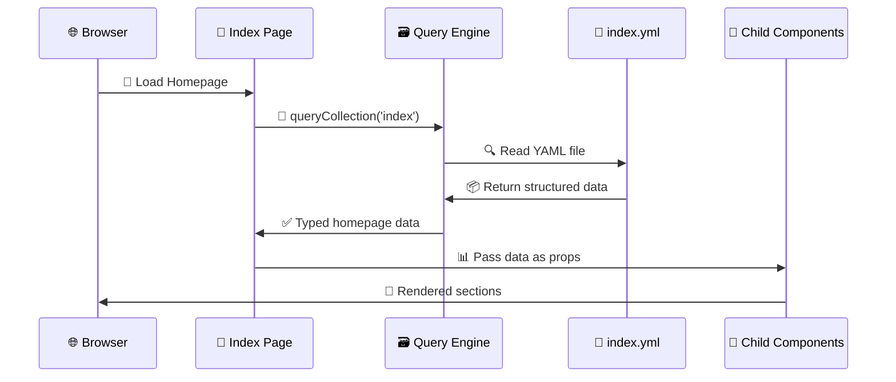

### 🏗️ Homepage Query Implementation

```vue
<script setup lang="ts">
import type { IndexCollectionItem } from '@nuxt/content'

// 📡 CONTENT FETCHING
// Query the homepage content from the YAML file
const { data: page } = await useAsyncData(
  'index',                          // 🗝️ Cache key for this query
  () => {
    return queryCollection('index')  // 🎯 Target the 'index' collection
      .first()                       // 📄 Get the single index.yml file
  }
)

// 🛡️ Type guard to ensure page exists
if (!page.value) {
  throw createError({
    statusCode: 500,
    statusMessage: '❌ Homepage content not found'
  })
}
```

### 🔍 SEO Configuration from Content

```vue
// 🔍 SEO CONFIGURATION
// Set meta tags from content (zero configuration needed!)
useSeoMeta({
  // 📝 Use SEO-specific title if provided, fallback to page title
  title: page.value.seo?.title || page.value.title,
  
  // 📄 Meta description for search engines
  description: page.value.seo?.description || page.value.description,
  
  // 📱 OPEN GRAPH tags for social sharing
  ogTitle: page.value.seo?.title || page.value.title,
  ogDescription: page.value.seo?.description || page.value.description,
  ogType: 'website',                 // 🌐 Website type for social platforms
  ogUrl: 'https://emmathompson.design', // 🔗 Canonical URL
  
  // 🐦 TWITTER CARD configuration
  twitterCard: 'summary_large_image', // 🖼️ Large image card format
  twitterSite: '@emmathompson',       // 🏢 Site Twitter handle
  
  // 🔍 ADDITIONAL META tags
  author: 'Emma Thompson',            // 👤 Content author
  robots: 'index, follow',            // 🤖 Search engine directives
  
  // 🎨 STRUCTURED DATA for rich snippets
  applicationName: 'Emma Thompson Portfolio',
  themeColor: '#00DC82'               // 🎨 Browser theme color
})

// 🖼️ Set Open Graph image if provided
if (page.value.seo?.image) {
  defineOgImage({ 
    url: page.value.seo.image,
    width: 1200,                      // 📐 Optimal width for social sharing
    height: 630,                      // 📐 Optimal height (1.91:1 ratio)
    alt: 'Emma Thompson - UX/UI Designer Portfolio'
  })
}
```

### 📊 Interactive Features

```vue
// 🎛️ VIEWPORT CONFIGURATION for enhanced UX
// Track scroll position for animations and interactions
const { y: scrollY } = useWindowScroll()

// 🔝 Show back-to-top button after scrolling
const showBackToTop = computed(() => scrollY.value > 300)

// ✨ Smooth scroll to top function
const scrollToTop = () => {
  window.scrollTo({ 
    top: 0, 
    behavior: 'smooth' 
  })
}
</script>

<template>
  <!-- 🏠 Root page component -->
  <UPage v-if="page">
    <!-- 🎨 Hero Section -->
    <!-- Pass entire page object - component extracts what it needs -->
    <LandingHero 
      :page="page"
      class="min-h-[80vh]"            <!-- ⚡ Ensure prominent hero -->
    />
    
    <!-- 📖 Main Content Sections -->
    <UPageSection>
      <!-- 📝 About Section -->
      <LandingAbout 
        :page="page"
        id="about"                     <!-- ⚓ Anchor for navigation -->
        class="scroll-mt-20"           <!-- 📏 Offset for fixed header -->
      />
      
      <!-- 💼 Work Experience Timeline -->
      <LandingWorkExperience 
        :page="page"
        id="experience"
        class="scroll-mt-20"
      />
    </UPageSection>
    
    <!-- 📝 Blog Section -->
    <!-- This component makes its own query for blog posts -->
    <LandingBlog 
      :page="page"
      id="blog"
      class="bg-muted/5"              <!-- 🎨 Subtle background -->
    />
    
    <!-- 💬 Testimonials Carousel -->
    <LandingTestimonials 
      :page="page"
      id="testimonials"
    />
    
    <!-- ❓ FAQ Accordion -->
    <LandingFAQ 
      :page="page"
      id="faq"
      class="mb-20"                   <!-- 📏 Bottom spacing -->
    />
    
    <!-- 🔝 Back to Top Button -->
    <Transition
      enter-active-class="transition-opacity duration-200"
      enter-from-class="opacity-0"
      enter-to-class="opacity-100"
      leave-active-class="transition-opacity duration-200"
      leave-from-class="opacity-100"
      leave-to-class="opacity-0"
    >
      <button
        v-if="showBackToTop"
        @click="scrollToTop"
        class="fixed bottom-8 right-8 p-3 bg-primary text-primary-foreground rounded-full shadow-lg hover:shadow-xl transition-shadow"
        aria-label="Back to top"
      >
        <Icon name="i-heroicons-arrow-up" class="w-5 h-5" />
      </button>
    </Transition>
  </UPage>
</template>
```

> **🔄 What did we learn?** The homepage acts as a content distributor, fetching YAML data once and passing it to specialized child components. SEO configuration comes directly from content, and scroll tracking adds interactive polish for enhanced user experience! ✨

---

## 🧩 Step 3: Child Component Implementation {#child-component-implementation}

**File:** `/app/components/landing/Blog.vue`

> **🎯 Goal**: Create a child component that receives parent data AND makes its own content queries

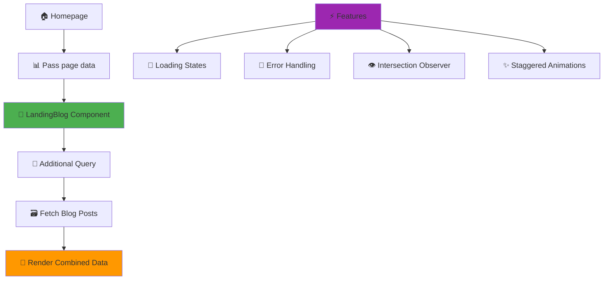

### 🎯 Props Definition and Type Safety

```vue
<script setup lang="ts">
import type { IndexCollectionItem, BlogCollectionItem } from '@nuxt/content'

// 📥 PROPS DEFINITION
// Receive the page data from parent component
const props = defineProps<{
  page: IndexCollectionItem          // 🎯 Fully typed from content schema
}>()

// 📡 ADDITIONAL DATA FETCHING
// While we receive page data from parent, we need to fetch actual blog posts
const { data: posts, pending, error, refresh } = await useAsyncData(
  'index-blogs',                     // 🗝️ Unique cache key
  () => queryCollection('blog')
    .where({                         // 🔍 Filter conditions
      draft: { $ne: true }           // 🚫 Exclude drafts ($ne = not equal)
    })
    .order('date', 'DESC')           // 📅 Sort by date, newest first
    .limit(3)                        // 🔢 Only get 3 most recent
    .all(),                          // 📦 Return array of results
  {
    // ⚡ OPTIMIZATION: only fetch required fields
    transform: (posts) => posts.map(post => ({
      path: post.path,
      title: post.title,
      description: post.description,
      date: post.date,
      image: post.image,
      minRead: post.minRead,
      categories: post.categories
    }))
  }
)
```

### 🎛️ Computed Properties and State Management

```vue
// 🎛️ COMPUTED PROPERTIES
// Check if we have the minimum data to render
const hasContent = computed(() => 
  posts.value && posts.value.length > 0
)

// 📅 Format date for human-readable display
const formatDate = (dateString: string) => {
  return new Intl.DateTimeFormat('en-US', {
    year: 'numeric',
    month: 'short',                  // ✨ "Jan" instead of "01"
    day: 'numeric'
  }).format(new Date(dateString))
}

// 🎨 Get reading time with emoji
const getReadingTimeText = (minutes: number) => {
  if (minutes <= 3) return `⚡ ${minutes} min read`
  if (minutes <= 10) return `📖 ${minutes} min read`
  return `📚 ${minutes} min read`
}
```

### 👁️ Intersection Observer for Animations

```vue
// 👁️ INTERSECTION OBSERVER for scroll-triggered animations
const cardsContainer = ref<HTMLElement>()
const { stop } = useIntersectionObserver(
  cardsContainer,
  ([{ isIntersecting }]) => {
    if (isIntersecting) {
      // 🎨 Trigger animation
      cardsContainer.value?.classList.add('animate-in')
      stop()                         // 🛑 Stop observing after animation
    }
  },
  { 
    threshold: 0.1,                  // 🎯 Trigger when 10% visible
    rootMargin: '50px'               // 📏 Start animation 50px before visible
  }
)
</script>
```

### 🎨 Advanced Template with State Management

```vue
<template>
  <!-- 📝 Blog section wrapper -->
  <UPageSection
    :title="page.blog.title"                    <!-- 📊 From YAML: "Latest Articles" -->
    :description="page.blog.description"        <!-- 📊 From YAML: "Thoughts on design..." -->
    class="bg-muted/5 py-24"
  >
    <!-- 📋 Section header slot for additional content -->
    <template #header>
      <!-- 🔗 View all link -->
      <div class="text-center mt-4">
        <NuxtLink
          to="/blog"
          class="text-sm text-muted hover:text-primary transition-colors inline-flex items-center gap-1"
        >
          <span>{{ page.blog.link?.label || 'View all articles' }}</span>
          <Icon name="i-heroicons-arrow-right" class="w-4 h-4" />
        </NuxtLink>
      </div>
    </template>

    <!-- 🔄 Loading state with skeleton -->
    <div v-if="pending" class="space-y-6">
      <div class="flex justify-center py-12">
        <div class="flex items-center gap-3">
          <Icon name="i-heroicons-arrow-path" class="w-6 h-6 animate-spin text-primary" />
          <span class="text-muted">Loading latest articles...</span>
        </div>
      </div>
      
      <!-- 💀 Skeleton cards -->
      <div class="grid md:grid-cols-3 gap-6">
        <div v-for="i in 3" :key="i" class="animate-pulse">
          <div class="bg-muted/20 h-48 rounded-lg mb-4"></div>
          <div class="bg-muted/20 h-4 rounded mb-2"></div>
          <div class="bg-muted/20 h-3 rounded w-3/4"></div>
        </div>
      </div>
    </div>

    <!-- 🚨 Error state with retry -->
    <div v-else-if="error" class="text-center py-12">
      <div class="max-w-md mx-auto">
        <Icon name="i-heroicons-exclamation-triangle" class="w-12 h-12 text-destructive mx-auto mb-4" />
        <h3 class="font-semibold mb-2">Failed to load blog posts</h3>
        <p class="text-muted text-sm mb-4">
          Something went wrong while fetching the latest articles.
        </p>
        <button 
          @click="refresh()"
          class="inline-flex items-center gap-2 px-4 py-2 bg-primary text-primary-foreground rounded-md hover:bg-primary/90 transition-colors"
        >
          <Icon name="i-heroicons-arrow-path" class="w-4 h-4" />
          Try again
        </button>
      </div>
    </div>

    <!-- 📝 Blog posts grid with animations -->
    <UBlogPosts
      v-else-if="hasContent"
      ref="cardsContainer"
      class="opacity-0 transition-opacity duration-700"
      :class="{ 'animate-in opacity-100': false }"
    >
      <!-- 🔄 Iterate through posts -->
      <UBlogPost
        v-for="(post, index) in posts"
        :key="post.path"                         <!-- 🗝️ Use path as unique key -->
        :to="post.path"                          <!-- 🔗 Link to full post -->
        :title="post.title"
        :description="post.description"
        :image="post.image"
        :date="formatDate(post.date)"
        :badge="getReadingTimeText(post.minRead)"
        :category="post.categories?.[0]"
        class="group hover:scale-[1.02] transition-transform duration-300"
        :style="{
          animationDelay: `${index * 150}ms`    <!-- ⚡ Stagger animations -->
        }"
      >
        <!-- 🎨 Custom slot for additional metadata -->
        <template #footer>
          <div class="flex items-center justify-between mt-4">
            <div class="flex items-center gap-2">
              <span class="text-xs text-muted">
                {{ formatDate(post.date) }}
              </span>
              <span class="text-xs text-muted">•</span>
              <span class="text-xs text-primary">
                {{ post.categories?.[0] || 'Article' }}
              </span>
            </div>
            <span class="text-xs text-primary opacity-0 group-hover:opacity-100 transition-opacity">
              Read more →
            </span>
          </div>
        </template>
      </UBlogPost>
    </UBlogPosts>

    <!-- 📭 Empty state -->
    <div v-else class="text-center py-12">
      <Icon name="i-heroicons-document-text" class="w-12 h-12 text-muted mx-auto mb-4" />
      <h3 class="font-semibold mb-2">No blog posts yet</h3>
      <p class="text-muted text-sm">
        Check back soon for the latest articles and insights!
      </p>
    </div>
  </UPageSection>
</template>

<style scoped>
/* 🎨 Animation for cards entering viewport */
@keyframes fadeInUp {
  from {
    opacity: 0;
    transform: translateY(30px);
  }
  to {
    opacity: 1;
    transform: translateY(0);
  }
}

.animate-in :deep(.blog-post) {
  animation: fadeInUp 0.6s ease-out forwards;
}

/* 🎯 Hover effects */
.group:hover .group-hover\:scale-\[1\.02\] {
  transform: scale(1.02);
}
</style>
```

> **💡 What did we learn?** Child components can make their own queries while receiving parent data! The Blog component demonstrates data fetching, error handling, loading states, skeleton UI, and intersection observer animations all working together for a polished user experience! 🎨✨

---

## 📁 Project Pages: Collections and Iterations {#project-pages}

Projects demonstrate how multiple YAML files create a powerful collection system! 🗂️💫

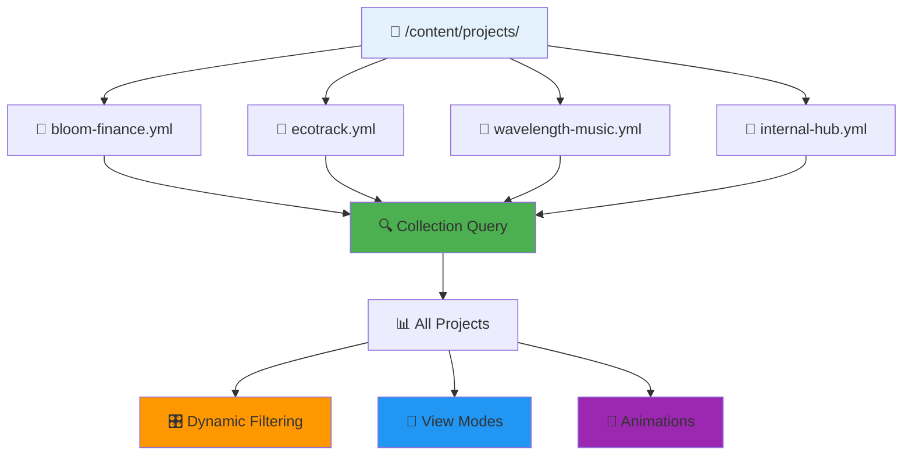

---

## 📋 Step 1: Individual Project Structure {#individual-project-structure}

**File:** `/content/projects/ecotrack.yml`

> **🎯 Goal**: Create rich project data that supports multiple display formats and detailed case studies

### 🏷️ Project Metadata and Basic Info

```yaml
# 🏷️ PROJECT METADATA
title: "EcoTrack - Sustainability Dashboard"
description: "Designed a comprehensive dashboard for tracking corporate sustainability metrics and ESG reporting"

# 🖼️ PROJECT HERO IMAGE with attribution
image: 
  src: "https://images.unsplash.com/photo-1497436072909-60f360e1d4b1"
  alt: "EcoTrack sustainability dashboard interface showing real-time environmental metrics"
  credit: "Photo by Markus Spiske on Unsplash"
  palette:                           # 🎨 Extracted color palette for theming
    primary: "#2E7D32"              # 🟢 Green primary
    secondary: "#1565C0"            # 🔵 Blue secondary
    accent: "#FF6F00"               # 🟠 Orange accent

# 🔗 PROJECT LINKS
url: "https://ecotrack.example.com"
external: true                      # 🚀 Opens in new tab
github: "https://github.com/ecotrack/dashboard"    # 📂 Source code (if available)
demo: "https://demo.ecotrack.com"   # 🎮 Live demo
```

### 📊 Project Classification and Status

```yaml
# 📅 PROJECT TIMELINE
date: "2024-02-15"                  # 📅 ISO date for sorting
startDate: "2023-10-01"            # 🏁 Project start
endDate: "2024-02-15"               # 🏁 Project completion
status: "completed"                 # ✅ completed | in-progress | archived | on-hold
featured: true                      # ⭐ Show in featured section
priority: "high"                    # 🔥 high | medium | low

# 🏷️ TAXONOMIES for filtering and organization
tags: 
  - "UX Design"
  - "Data Visualization"
  - "Dashboard Design"
  - "Sustainability"
  - "Enterprise"
  - "B2B"

categories:
  - "Web Application"
  - "Data Dashboard"
  - "Enterprise Software"

industries:
  - "Environmental"
  - "Corporate ESG"
  - "Data Analytics"
```

### 👥 Project Details and Team Information

```yaml
# 👥 DETAILED PROJECT INFORMATION
details:
  role: "Lead UX Designer"
  team: "2 Designers, 4 Developers, 1 PM, 1 Data Scientist"
  duration: "4 months"
  client: "EcoTrack Inc"
  budget: "$150,000"                # 💰 Project budget (if shareable)
  methodology: "Design Thinking + Agile"
  
  # 🎯 PROJECT SCOPE
  scope:
    - "User Research & Analysis"
    - "Information Architecture"
    - "UI/UX Design"
    - "Design System Creation"
    - "Prototype Development"
    - "Usability Testing"
    - "Development Handoff"
```

### ✨ Project Highlights and Features

```yaml
# ✨ KEY FEATURES AND HIGHLIGHTS
highlights:
  - title: "Real-time Data Visualization"
    description: "Created interactive charts and graphs for live sustainability metrics tracking"
    icon: "i-heroicons-chart-bar"
    impact: "75% faster data processing"
    details: |
      Implemented D3.js-powered visualizations that update in real-time as new environmental 
      data streams in from IoT sensors and third-party APIs. Users can drill down from 
      high-level KPIs to granular metrics with smooth animations.
    
  - title: "Customizable Dashboards"
    description: "Users can create personalized views of their ESG data with drag-and-drop widgets"
    icon: "i-heroicons-adjustments-horizontal"
    impact: "200% increase in user engagement"
    details: |
      Built a flexible dashboard system where users can arrange widgets, choose metrics, 
      and save custom views. Each role (CSO, Data Analyst, Executive) gets tailored 
      default layouts optimized for their workflows.
    
  - title: "Automated Reporting"
    description: "One-click generation of compliance reports for various ESG frameworks"
    icon: "i-heroicons-document-chart-bar"
    impact: "90% reduction in report preparation time"
    details: |
      Integrated with GRI, SASB, and TCFD frameworks to automatically generate 
      compliant reports. Smart templates pull relevant data and format it according 
      to each framework's requirements.
    
  - title: "Predictive Analytics"
    description: "Machine learning models predict future sustainability trends and identify risks"
    icon: "i-heroicons-sparkles"
    impact: "3-month forecast accuracy of 94%"
    details: |
      Collaborated with data science team to integrate ML models that analyze 
      historical patterns and external factors to predict future environmental 
      performance and highlight potential risks.
```

### 📈 Project Metrics and Results

```yaml
# 📈 PROJECT METRICS AND BUSINESS IMPACT
metrics:
  performance:
    - label: "Data Processing Time"
      value: "75% faster"
      trend: "up"
      baseline: "45 minutes"
      current: "11 minutes"
      
    - label: "User Task Completion"
      value: "94% success rate"
      trend: "up"
      baseline: "67%"
      current: "94%"
      
    - label: "Report Generation"
      value: "< 30 seconds"
      trend: "up"
      baseline: "8 hours"
      current: "28 seconds"
  
  business:
    - label: "User Satisfaction"
      value: "4.8/5"
      trend: "up"
      source: "Post-launch survey (n=156)"
      
    - label: "Time to Insights"
      value: "85% reduction"
      trend: "up"
      description: "From data upload to actionable insights"
      
    - label: "Compliance Efficiency"
      value: "300% improvement"
      trend: "up"
      description: "Time to generate regulatory reports"
  
  technical:
    - label: "Page Load Time"
      value: "1.2s average"
      trend: "up"
      target: "< 2s"
      
    - label: "Data Accuracy"
      value: "99.7%"
      trend: "stable"
      description: "Cross-validated with manual audits"
```

### 🛠️ Tools and Technology Stack

```yaml
# 🛠️ TOOLS AND TECHNOLOGIES USED
tools:
  design:
    - name: "Figma"
      purpose: "UI Design & Prototyping"
      version: "2023"
    - name: "FigJam"
      purpose: "Collaborative Workshops"
    - name: "Principle"
      purpose: "Micro-interactions"
    - name: "Adobe Illustrator"
      purpose: "Icon Design"
      
  research:
    - name: "Maze"
      purpose: "Usability Testing"
    - name: "Hotjar"
      purpose: "User Behavior Analytics"
    - name: "Google Analytics"
      purpose: "Usage Metrics"
    - name: "Dovetail"
      purpose: "Research Repository"
      
  development:
    - name: "Vue.js 3"
      purpose: "Frontend Framework"
    - name: "D3.js"
      purpose: "Data Visualization"
    - name: "Tailwind CSS"
      purpose: "Styling Framework"
    - name: "Node.js"
      purpose: "Backend API"
    - name: "PostgreSQL"
      purpose: "Database"
    - name: "Redis"
      purpose: "Caching Layer"
      
  infrastructure:
    - name: "AWS"
      purpose: "Cloud Hosting"
    - name: "Docker"
      purpose: "Containerization"
    - name: "GitHub Actions"
      purpose: "CI/CD Pipeline"
```

### 📚 Case Study Sections

```yaml
# 📚 DETAILED CASE STUDY (if full case study page exists)
caseStudy:
  challenge: |
    EcoTrack needed to transform complex environmental data from multiple sources into 
    actionable insights for corporate sustainability teams. The existing solution was 
    spreadsheet-based, couldn't scale with growing data volumes, and took weeks to 
    generate compliance reports.
    
    Key challenges included:
    • Data silos across different departments and systems
    • Manual processes prone to errors and delays  
    • Lack of real-time visibility into sustainability performance
    • Complex regulatory requirements with frequent changes
    • Limited data visualization capabilities
    
  process: |
    **Phase 1: Discovery & Research (4 weeks)**
    • Conducted 23 stakeholder interviews across CSO, Finance, and Operations teams
    • Observed current workflows and pain points through contextual inquiries
    • Analyzed existing data sources and integration challenges
    • Benchmarked 12 competitor solutions and identified gaps
    
    **Phase 2: Define & Ideate (3 weeks)**  
    • Created user personas for different roles (CSO, Data Analyst, Executive)
    • Developed information architecture through card sorting sessions
    • Mapped user journeys for key workflows (data analysis, report generation)
    • Conducted design thinking workshops to generate solution concepts
    
    **Phase 3: Design & Prototype (8 weeks)**
    • Built low-fi wireframes for core functionality
    • Created interactive prototypes for user testing
    • Developed comprehensive design system with 45+ components
    • Designed responsive layouts for desktop and tablet use
    
    **Phase 4: Test & Iterate (3 weeks)**
    • Conducted moderated usability tests with 18 participants
    • A/B tested different dashboard layouts and information hierarchies
    • Refined micro-interactions and transition animations
    • Validated accessibility compliance (WCAG 2.1 AA)
    
  solution: |
    **Modular Dashboard System**
    Designed a flexible, widget-based dashboard where users can customize their view 
    based on role and responsibilities. Each widget is self-contained and can display 
    real-time data with interactive drill-down capabilities.
    
    **Progressive Disclosure**
    Implemented a three-tier information hierarchy: overview → details → raw data. 
    This allows executives to get high-level insights while analysts can access 
    granular data when needed.
    
    **Intelligent Automation**  
    Created smart templates that automatically pull relevant metrics based on 
    reporting frameworks (GRI, SASB, TCFD) and generate compliant reports with 
    minimal manual intervention.
    
    **Design System**
    Built a comprehensive design system optimized for data-heavy interfaces, 
    including specialized components for charts, data tables, and status indicators.
    
  impact: |
    **Business Impact**
    • Reduced report generation time from 8 hours to 28 seconds (1,714% improvement)
    • Increased user engagement by 200% in first 6 months
    • Achieved 94% task completion rate vs. 67% with previous system
    • Enabled real-time tracking of sustainability goals vs. quarterly updates
    
    **User Impact**  
    • 4.8/5 user satisfaction score (up from 2.1/5)
    • 85% reduction in time to insights
    • 90% fewer user-reported errors
    • 76% increase in daily active users
    
    **Technical Impact**
    • 99.7% data accuracy (validated through manual audits)
    • 1.2s average page load time across all dashboards
    • 99.9% uptime since launch
    • Successfully handling 10x data volume growth
    
    **Recognition**
    • UX Design Awards 2024 - Best Enterprise Dashboard
    • Sustainability Software of the Year - GreenTech Awards
    • Featured in Harvard Business Review case study
```

### 🔗 Related Projects and Navigation

```yaml
# 🔗 RELATED PROJECTS for cross-navigation
related:
  - slug: "bloom-finance"
    relationship: "Similar complexity"
    reason: "Both are data-heavy dashboard projects"
    
  - slug: "wavelength-music"
    relationship: "Shared techniques"
    reason: "Used similar data visualization approaches"
    
  - slug: "internal-developer-hub"
    relationship: "Same client type"
    reason: "Both are enterprise B2B applications"

# 🎯 PROJECT TAGS for better discoverability
seo:
  keywords:
    - "sustainability dashboard design"
    - "ESG reporting interface"
    - "environmental data visualization"
    - "corporate sustainability UX"
    - "green technology interface design"
```

> **💡 What did we learn?** Project YAML files are like comprehensive database records! They contain everything from basic metadata to detailed case studies, metrics, and cross-references. This rich structure supports multiple use cases: project listings, detailed case studies, filtering, and SEO optimization. 📊✨

---

## 📊 Step 2: Projects Listing Page {#projects-listing-page}

**File:** `/app/pages/projects.vue`

> **🎯 Goal**: Create a sophisticated project showcase with filtering, search, and multiple view modes

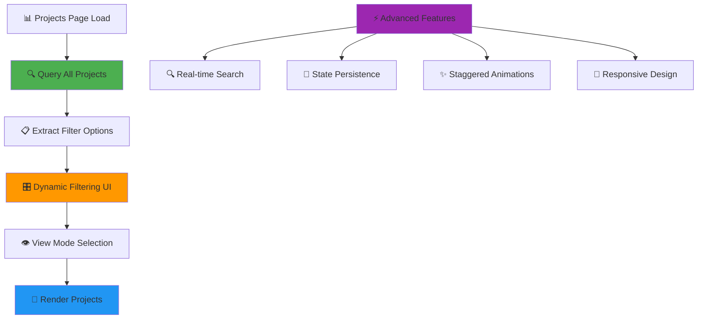

### 🏗️ Page Setup and Data Fetching

```vue
<script setup lang="ts">
import type { ProjectsCollectionItem, ProjectCollectionItem } from '@nuxt/content'

// 📄 PAGE CONTENT QUERY
// Get the projects page metadata and configuration
const { data: page } = await useAsyncData(
  'projects-page',
  () => queryCollection('pages')
    .path('/projects')               // 🎯 Specific page path
    .first()
)

// 📊 PROJECTS COLLECTION QUERY
// Get all projects with comprehensive data
const { data: projects, pending } = await useAsyncData(
  'projects',
  () => queryCollection('projects')
    .where({                         // 🔍 Filter options
      status: { $ne: 'archived' }   // 🚫 Exclude archived projects
    })
    .order('featured', 'DESC')       // ⭐ Featured projects first
    .order('date', 'DESC')           // 📅 Then by date, newest first
    .all()
)
```

### 🎛️ Advanced Filtering System

```vue
// 🎛️ FILTERING AND SORTING STATE
const filters = ref({
  category: 'all',
  tag: 'all',
  industry: 'all',
  status: 'all',
  featured: false,
  search: ''                         // 🔍 Text search
})

// 📊 EXTRACT UNIQUE FILTER OPTIONS
// Dynamically generate filter options from project data
const categories = computed(() => {
  if (!projects.value) return []
  const cats = new Set<string>()
  projects.value.forEach(project => {
    project.categories?.forEach(category => cats.add(category))
  })
  return Array.from(cats).sort()
})

const tags = computed(() => {
  if (!projects.value) return []
  const tagSet = new Set<string>()
  projects.value.forEach(project => {
    project.tags?.forEach(tag => tagSet.add(tag))
  })
  return Array.from(tagSet).sort()
})

const industries = computed(() => {
  if (!projects.value) return []
  const industrySet = new Set<string>()
  projects.value.forEach(project => {
    project.industries?.forEach(industry => industrySet.add(industry))
  })
  return Array.from(industrySet).sort()
})

// 🎯 SMART FILTERING LOGIC
const filteredProjects = computed(() => {
  if (!projects.value) return []
  
  return projects.value.filter(project => {
    // 📂 Category filter
    if (filters.value.category !== 'all' && 
        !project.categories?.includes(filters.value.category)) {
      return false
    }
    
    // 🏷️ Tag filter
    if (filters.value.tag !== 'all' && 
        !project.tags?.includes(filters.value.tag)) {
      return false
    }
    
    // 🏢 Industry filter
    if (filters.value.industry !== 'all' && 
        !project.industries?.includes(filters.value.industry)) {
      return false
    }
    
    // 📋 Status filter
    if (filters.value.status !== 'all' && 
        project.status !== filters.value.status) {
      return false
    }
    
    // ⭐ Featured filter
    if (filters.value.featured && !project.featured) {
      return false
    }
    
    // 🔍 Text search across multiple fields
    if (filters.value.search.trim()) {
      const searchTerm = filters.value.search.toLowerCase()
      const searchableText = [
        project.title,
        project.description,
        ...(project.tags || []),
        ...(project.categories || []),
        ...(project.industries || []),
        project.details?.client
      ].filter(Boolean).join(' ').toLowerCase()
      
      if (!searchableText.includes(searchTerm)) {
        return false
      }
    }
    
    return true
  })
})

// 📊 FILTER STATISTICS
const filterStats = computed(() => ({
  total: projects.value?.length || 0,
  filtered: filteredProjects.value.length,
  featured: projects.value?.filter(p => p.featured).length || 0,
  completed: projects.value?.filter(p => p.status === 'completed').length || 0
}))
```

### 💾 View Preferences and State Persistence

```vue
// 👁️ VIEW PREFERENCES
const viewMode = ref<'grid' | 'list' | 'cards'>('grid')
const sortBy = ref<'date' | 'title' | 'featured'>('date')
const sortOrder = ref<'asc' | 'desc'>('desc')

// 💾 PERSIST USER PREFERENCES in localStorage
watchEffect(() => {
  if (process.client) {
    localStorage.setItem('projects-view-mode', viewMode.value)
    localStorage.setItem('projects-sort-by', sortBy.value)
    localStorage.setItem('projects-sort-order', sortOrder.value)
  }
})

// 🔄 RESTORE PREFERENCES on page load
onMounted(() => {
  if (process.client) {
    const savedViewMode = localStorage.getItem('projects-view-mode')
    const savedSortBy = localStorage.getItem('projects-sort-by')
    const savedSortOrder = localStorage.getItem('projects-sort-order')
    
    if (savedViewMode && ['grid', 'list', 'cards'].includes(savedViewMode)) {
      viewMode.value = savedViewMode as any
    }
    if (savedSortBy && ['date', 'title', 'featured'].includes(savedSortBy)) {
      sortBy.value = savedSortBy as any
    }
    if (savedSortOrder && ['asc', 'desc'].includes(savedSortOrder)) {
      sortOrder.value = savedSortOrder as any
    }
  }
})

// 🎯 CLEAR ALL FILTERS function
const clearFilters = () => {
  filters.value = {
    category: 'all',
    tag: 'all',
    industry: 'all',
    status: 'all',
    featured: false,
    search: ''
  }
}

// 🔍 SEO CONFIGURATION
useSeoMeta({
  title: page.value?.seo?.title || 'Projects | Emma Thompson',
  description: page.value?.seo?.description || 'Explore my UX/UI design projects and case studies',
  ogType: 'website'
})
</script>
```

### 🎨 Advanced Template with Multiple View Modes

```vue
<template>
  <UPage v-if="page">
    <!-- 📋 Page Header with Stats -->
    <UPageHero
      :title="page.title"
      :description="page.description"
      class="text-center"
    >
      <!-- 📊 Project Statistics -->
      <template #badge>
        <div class="flex items-center gap-4 text-sm text-muted">
          <span>📁 {{ filterStats.total }} total projects</span>
          <span>⭐ {{ filterStats.featured }} featured</span>
          <span>✅ {{ filterStats.completed }} completed</span>
        </div>
      </template>
      
      <!-- 🎛️ Advanced Filter Controls -->
      <template #footer>
        <div class="mt-8 space-y-4">
          <!-- 🔍 Search Bar -->
          <div class="max-w-md mx-auto">
            <UInput
              v-model="filters.search"
              placeholder="🔍 Search projects..."
              icon="i-heroicons-magnifying-glass"
              size="lg"
              class="w-full"
            />
          </div>
          
          <!-- 🎛️ Filter Grid -->
          <div class="flex flex-wrap gap-4 justify-center">
            <!-- 📂 Category Filter -->
            <USelectMenu
              v-model="filters.category"
              :options="[
                { label: '📂 All Categories', value: 'all' },
                ...categories.map(c => ({ label: c, value: c }))
              ]"
              class="w-48"
            />
            
            <!-- 🏷️ Tag Filter -->
            <USelectMenu
              v-model="filters.tag"
              :options="[
                { label: '🏷️ All Tags', value: 'all' },
                ...tags.map(t => ({ label: t, value: t }))
              ]"
              class="w-48"
            />
            
            <!-- 🏢 Industry Filter -->
            <USelectMenu
              v-model="filters.industry"
              :options="[
                { label: '🏢 All Industries', value: 'all' },
                ...industries.map(i => ({ label: i, value: i }))
              ]"
              class="w-48"
            />
            
            <!-- 📋 Status Filter -->
            <USelectMenu
              v-model="filters.status"
              :options="[
                { label: '📋 All Status', value: 'all' },
                { label: '✅ Completed', value: 'completed' },
                { label: '🚧 In Progress', value: 'in-progress' },
                { label: '⏸️ On Hold', value: 'on-hold' }
              ]"
              class="w-48"
            />
            
            <!-- ⭐ Featured Toggle -->
            <UToggle
              v-model="filters.featured"
              :label="`⭐ Featured Only (${filterStats.featured})`"
            />
          </div>
          
          <!-- 🎨 View Controls -->
          <div class="flex items-center justify-between">
            <div class="flex items-center gap-2">
              <span class="text-sm text-muted">
                Showing {{ filteredProjects.length }} of {{ filterStats.total }} projects
              </span>
              <UButton
                v-if="filteredProjects.length < filterStats.total"
                @click="clearFilters"
                variant="ghost"
                size="sm"
              >
                Clear filters
              </UButton>
            </div>
            
            <!-- 👁️ View Mode Toggle -->
            <UButtonGroup>
              <UButton
                :color="viewMode === 'grid' ? 'primary' : 'neutral'"
                @click="viewMode = 'grid'"
                icon="i-heroicons-squares-2x2"
                aria-label="Grid view"
                size="sm"
              />
              <UButton
                :color="viewMode === 'list' ? 'primary' : 'neutral'"
                @click="viewMode = 'list'"
                icon="i-heroicons-list-bullet"
                aria-label="List view"
                size="sm"
              />
              <UButton
                :color="viewMode === 'cards' ? 'primary' : 'neutral'"
                @click="viewMode = 'cards'"
                icon="i-heroicons-rectangle-group"
                aria-label="Card view"
                size="sm"
              />
            </UButtonGroup>
          </div>
        </div>
      </template>
    </UPageHero>
    
    <!-- 📊 Projects Section -->
    <UPageSection>
      <!-- 🔄 Loading State -->
      <div v-if="pending" class="space-y-6">
        <div class="flex justify-center py-12">
          <div class="flex items-center gap-3">
            <Icon name="i-heroicons-arrow-path" class="w-6 h-6 animate-spin text-primary" />
            <span class="text-muted">Loading projects...</span>
          </div>
        </div>
        
        <!-- 💀 Skeleton Grid -->
        <div class="grid md:grid-cols-2 lg:grid-cols-3 gap-6">
          <div v-for="i in 6" :key="i" class="animate-pulse">
            <div class="bg-muted/20 h-48 rounded-lg mb-4"></div>
            <div class="bg-muted/20 h-4 rounded mb-2"></div>
            <div class="bg-muted/20 h-3 rounded w-3/4"></div>
          </div>
        </div>
      </div>
      
      <!-- 🎨 Grid View -->
      <div
        v-else-if="viewMode === 'grid' && filteredProjects.length > 0"
        class="grid md:grid-cols-2 lg:grid-cols-3 gap-8"
      >
        <Motion
          v-for="(project, index) in filteredProjects"
          :key="project.title"
          :initial="{ 
            opacity: 0, 
            transform: 'translateY(20px)' 
          }"
          :while-in-view="{ 
            opacity: 1, 
            transform: 'translateY(0)' 
          }"
          :transition="{ 
            delay: 0.1 * (index % 6),    <!-- ⚡ Stagger by row -->
            duration: 0.4 
          }"
          :viewport="{ once: true }"      <!-- 👁️ Only animate once -->
        >
          <UPageCard
            :title="project.title"
            :description="project.description"
            :to="project.url"
            :external="project.external"
            class="h-full group hover:scale-[1.02] transition-transform duration-300"
          >
            <!-- 📅 Project Date and Status -->
            <template #leading>
              <div class="flex items-center justify-between">
                <span class="text-sm text-muted">
                  {{ new Date(project.date).getFullYear() }}
                </span>
                <span 
                  :class="{
                    'bg-green-100 text-green-800': project.status === 'completed',
                    'bg-blue-100 text-blue-800': project.status === 'in-progress',
                    'bg-yellow-100 text-yellow-800': project.status === 'on-hold'
                  }"
                  class="px-2 py-1 rounded-full text-xs font-medium"
                >
                  {{ project.status }}
                </span>
              </div>
            </template>
            
            <!-- 🖼️ Project Image with Overlay -->
            <div class="relative overflow-hidden rounded-lg">
              
              
              <!-- ⭐ Featured Badge -->
              <div 
                v-if="project.featured"
                class="absolute top-4 right-4 bg-primary text-primary-foreground px-3 py-1 rounded-full text-sm font-medium"
              >
                ⭐ Featured
              </div>
              
              <!-- 🎨 Color Palette Preview -->
              <div 
                v-if="project.image.palette"
                class="absolute bottom-4 left-4 flex gap-1"
              >
                <div 
                  v-for="(color, key) in project.image.palette"
                  :key="key"
                  :style="{ backgroundColor: color }"
                  class="w-4 h-4 rounded-full border-2 border-white shadow-sm"
                  :title="key"
                />
              </div>
            </div>
            
            <!-- 🏷️ Project Tags -->
            <div class="flex flex-wrap gap-2 mt-4">
              <span
                v-for="tag in project.tags?.slice(0, 3)"
                :key="tag"
                class="text-xs px-2 py-1 bg-muted/10 rounded-full"
              >
                {{ tag }}
              </span>
              <span 
                v-if="project.tags && project.tags.length > 3"
                class="text-xs px-2 py-1 bg-muted/10 rounded-full text-muted"
              >
                +{{ project.tags.length - 3 }} more
              </span>
            </div>
            
            <!-- 📊 Project Metrics -->
            <div 
              v-if="project.metrics?.performance?.length"
              class="grid grid-cols-2 gap-4 mt-6 pt-6 border-t"
            >
              <div
                v-for="metric in project.metrics.performance.slice(0, 2)"
                :key="metric.label"
                class="text-center"
              >
                <div class="text-lg font-semibold text-primary">
                  {{ metric.value }}
                </div>
                <div class="text-xs text-muted">
                  {{ metric.label }}
                </div>
              </div>
            </div>
          </UPageCard>
        </Motion>
      </div>
      
      <!-- 📋 List View -->
      <div
        v-else-if="viewMode === 'list' && filteredProjects.length > 0"
        class="space-y-6"
      >
        <Motion
          v-for="(project, index) in filteredProjects"
          :key="project.title"
          :initial="{ opacity: 0, x: -20 }"
          :while-in-view="{ opacity: 1, x: 0 }"
          :transition="{ delay: 0.05 * index }"
          :viewport="{ once: true }"
        >
          <div class="group p-6 border rounded-lg hover:border-primary/50 transition-colors">
            <div class="grid md:grid-cols-4 gap-6">
              <!-- 🖼️ Project Image -->
              <div class="relative overflow-hidden rounded-lg">
                
              </div>
              
              <!-- 📝 Project Details -->
              <div class="md:col-span-2 space-y-2">
                <div class="flex items-start justify-between">
                  <h3 class="font-semibold text-lg group-hover:text-primary transition-colors">
                    {{ project.title }}
                  </h3>
                  <div class="flex items-center gap-2">
                    <span 
                      v-if="project.featured"
                      class="text-xs bg-primary/10 text-primary px-2 py-1 rounded-full"
                    >
                      ⭐ Featured
                    </span>
                    <span class="text-sm text-muted">
                      {{ new Date(project.date).getFullYear() }}
                    </span>
                  </div>
                </div>
                
                <p class="text-muted text-sm line-clamp-2">
                  {{ project.description }}
                </p>
                
                <div class="flex flex-wrap gap-1">
                  <span
                    v-for="tag in project.tags?.slice(0, 4)"
                    :key="tag"
                    class="text-xs px-2 py-1 bg-muted/10 rounded text-muted"
                  >
                    {{ tag }}
                  </span>
                </div>
              </div>
              
              <!-- 📊 Quick Stats -->
              <div class="space-y-3">
                <dl class="space-y-1 text-sm">
                  <div v-if="project.details?.role">
                    <dt class="text-muted text-xs">Role</dt>
                    <dd class="font-medium">{{ project.details.role }}</dd>
                  </div>
                  <div v-if="project.details?.duration">
                    <dt class="text-muted text-xs">Duration</dt>
                    <dd class="font-medium">{{ project.details.duration }}</dd>
                  </div>
                  <div v-if="project.details?.client">
                    <dt class="text-muted text-xs">Client</dt>
                    <dd class="font-medium">{{ project.details.client }}</dd>
                  </div>
                </dl>
                
                <NuxtLink
                  :to="project.url"
                  :external="project.external"
                  class="inline-flex items-center gap-1 text-sm text-primary hover:text-primary/80 transition-colors"
                >
                  <span>View Project</span>
                  <Icon 
                    :name="project.external ? 'i-heroicons-arrow-top-right-on-square' : 'i-heroicons-arrow-right'"
                    class="w-4 h-4"
                  />
                </NuxtLink>
              </div>
            </div>
          </div>
        </Motion>
      </div>
      
      <!-- 🃏 Card View -->
      <div
        v-else-if="viewMode === 'cards' && filteredProjects.length > 0"
        class="columns-1 md:columns-2 lg:columns-3 gap-6 space-y-6"
      >
        <Motion
          v-for="(project, index) in filteredProjects"
          :key="project.title"
          :initial="{ opacity: 0, scale: 0.9 }"
          :while-in-view="{ opacity: 1, scale: 1 }"
          :transition="{ delay: 0.1 * (index % 3) }"
          :viewport="{ once: true }"
        >
          <div class="break-inside-avoid bg-card border rounded-lg p-6 hover:shadow-lg transition-shadow">
            <!-- 🎨 Header with Status -->
            <div class="flex items-start justify-between mb-4">
              <div class="flex-1">
                <h3 class="font-semibold text-lg mb-1">{{ project.title }}</h3>
                <p class="text-muted text-sm">{{ project.details?.client }}</p>
              </div>
              <span 
                :class="{
                  'bg-green-100 text-green-800': project.status === 'completed',
                  'bg-blue-100 text-blue-800': project.status === 'in-progress',
                  'bg-yellow-100 text-yellow-800': project.status === 'on-hold'
                }"
                class="px-2 py-1 rounded-full text-xs font-medium flex-shrink-0"
              >
                {{ project.status }}
              </span>
            </div>
            
            <!-- 📝 Description -->
            <p class="text-sm text-muted mb-4 line-clamp-3">
              {{ project.description }}
            </p>
            
            <!-- 🏷️ Tags -->
            <div class="flex flex-wrap gap-1 mb-4">
              <span
                v-for="tag in project.tags?.slice(0, 3)"
                :key="tag"
                class="text-xs px-2 py-1 bg-muted/10 rounded"
              >
                {{ tag }}
              </span>
            </div>
            
            <!-- 📊 Highlight Metric -->
            <div 
              v-if="project.metrics?.business?.[0]"
              class="bg-primary/5 p-3 rounded mb-4"
            >
              <div class="text-lg font-semibold text-primary">
                {{ project.metrics.business[0].value }}
              </div>
              <div class="text-xs text-muted">
                {{ project.metrics.business[0].label }}
              </div>
            </div>
            
            <!-- 🔗 Action -->
            <NuxtLink
              :to="project.url"
              :external="project.external"
              class="inline-flex items-center gap-2 text-sm font-medium text-primary hover:text-primary/80 transition-colors"
            >
              <span>{{ project.external ? 'View Live' : 'View Details' }}</span>
              <Icon 
                :name="project.external ? 'i-heroicons-arrow-top-right-on-square' : 'i-heroicons-arrow-right'"
                class="w-4 h-4"
              />
            </NuxtLink>
          </div>
        </Motion>
      </div>
      
      <!-- 📭 Empty State -->
      <div 
        v-else-if="filteredProjects.length === 0 && !pending"
        class="text-center py-24"
      >
        <Icon name="i-heroicons-folder-open" class="w-16 h-16 mx-auto mb-6 text-muted" />
        <h3 class="text-xl font-semibold mb-2">No projects found</h3>
        <p class="text-muted mb-6 max-w-md mx-auto">
          {{ filters.search || filters.category !== 'all' || filters.tag !== 'all' 
             ? 'Try adjusting your filters to see more projects.' 
             : 'Projects will appear here as they are added to the portfolio.' }}
        </p>
        <UButton
          v-if="filters.search || filters.category !== 'all' || filters.tag !== 'all'"
          @click="clearFilters"
          variant="outline"
        >
          🔄 Clear all filters
        </UButton>
      </div>
    </UPageSection>
  </UPage>
</template>

<style scoped>
/* 🎨 Custom animations and styles */
.line-clamp-2 {
  display: -webkit-box;
  -webkit-line-clamp: 2;
  -webkit-box-orient: vertical;
  overflow: hidden;
}

.line-clamp-3 {
  display: -webkit-box;
  -webkit-line-clamp: 3;
  -webkit-box-orient: vertical;
  overflow: hidden;
}

/* 🎯 Smooth hover effects */
.group:hover .group-hover\:scale-105 {
  transform: scale(1.05);
}

.group:hover .group-hover\:text-primary {
  color: rgb(var(--color-primary));
}

/* 📱 Responsive columns for card view */
@media (max-width: 768px) {
  .columns-1 {
    column-count: 1;
  }
}

@media (min-width: 769px) and (max-width: 1024px) {
  .columns-2 {
    column-count: 2;
  }
}

@media (min-width: 1025px) {
  .columns-3 {
    column-count: 3;
  }
}
</style>
```

> **🎨 What did we learn?** The projects page showcases advanced patterns: real-time search, dynamic filtering, view mode persistence, responsive layouts, staggered animations, and comprehensive state management. It's like a mini-CMS interface built entirely with content queries and Vue reactivity! 💫✨

---

## 🎯 Quick Reference

| Feature | Purpose | Example |
|---------|---------|---------|
| 📊 YAML Files | Structured data | `projects/*.yml` |
| 📝 Markdown Files | Rich content | `blog/*.md` |
| ✅ Zod Schemas | Type safety | `content.config.ts` |
| 🛣️ Dynamic Routes | URL handling | `[...slug].vue` |
| 📡 Query API | Content fetching | `queryCollection()` |
| ⚡ ContentRenderer | Markdown processing | `<ContentRenderer>` |

---

## 🗃️ Content Queries: The Power of File-Based Databases {#content-queries}

> **🎯 Master the Query Engine**: Transform your file system into a powerful, type-safe database with advanced querying capabilities!

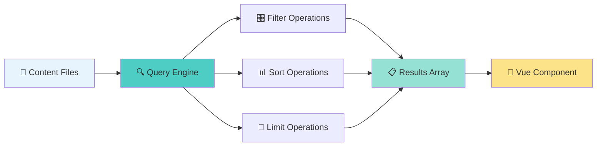

### 🔍 Basic Query Operations {#basic-query-operations}

The query system in Nuxt Content provides database-like operations directly on your file system! 🚀

#### 📝 Query Structure Example (Block 6.1.1)

```typescript
// 🎯 Basic query pattern - the foundation of all content operations
const { data: posts } = await useAsyncData('blog-posts', () => 
  queryCollection('blog')           // 📂 Target the 'blog' collection
    .order('date', 'DESC')          // 📅 Sort by date, newest first
    .limit(5)                       // 🎯 Get only 5 results
    .all()                          // 📋 Execute and return array
)
```

#### 📝 Query Structure Example (Block 6.1.2 - Advanced Filtering)

```typescript
// 🔍 Advanced filtering with multiple conditions
const { data: featuredPosts } = await useAsyncData('featured-posts', () =>
  queryCollection('blog')
    .where('featured', true)        // ⭐ Only featured posts
    .where('status', 'published')   // ✅ Only published content
    .order('date', 'DESC')          // 📅 Latest first
    .all()
)
```

#### 📝 Query Structure Example (Block 6.1.3 - Single Item Queries)

```typescript
// 🎯 Getting a single item - perfect for detail pages
const { data: project } = await useAsyncData(`project-${slug}`, () =>
  queryCollection('projects')
    .path(`/projects/${slug}`)      // 🛣️ Exact path match
    .first()                        // 🎯 Get first (and only) result
)
```

> **💡 What did we learn?** Nuxt Content's query system provides familiar database operations (`where`, `order`, `limit`) while working directly with your file system, giving you the best of both worlds! 🎉

### 🎛️ Advanced Filtering and Sorting {#advanced-filtering}

Let's explore the sophisticated filtering capabilities that make content management a breeze! 🌟

#### 📝 Real-World About Page Implementation (Block 6.2.1)

Looking at our actual About page implementation:

```vue
<!-- 📍 /app/pages/about.vue - Real implementation -->
<script setup lang="ts">
const { data: page } = await useAsyncData('about', () => {
  return queryCollection('about').first()  // 🎯 Get single about page
})

if (!page.value) {
  throw createError({
    statusCode: 404,
    statusMessage: 'Page not found',
    fatal: true
  })
}

// 🔧 Global app configuration access
const { global } = useAppConfig()

// 🔍 SEO meta configuration from content
useSeoMeta({
  title: page.value?.seo?.title || page.value?.title,
  ogTitle: page.value?.seo?.title || page.value?.title,
  description: page.value?.seo?.description || page.value?.description,
  ogDescription: page.value?.seo?.description || page.value?.description
})
</script>
```

#### 📝 Real-World Blog Component Query (Block 6.2.2)

From our landing page Blog component:

```vue
<!-- 📍 /app/components/landing/Blog.vue - Real implementation -->
<script setup lang="ts">
import type { IndexCollectionItem } from '@nuxt/content'

defineProps<{
  page: IndexCollectionItem  // 🎯 Type-safe props
}>()

// 🔍 Advanced query with ordering and limiting
const { data: posts } = await useAsyncData('index-blogs', () =>
  queryCollection('blog')
    .order('date', 'DESC')    // 📅 Newest posts first
    .limit(3)                 // 🎯 Only show 3 posts on homepage
    .all()
)

if (!posts.value) {
  throw createError({ 
    statusCode: 404,
    statusMessage: 'blog posts not found',
    fatal: true 
  })
}
</script>
```

#### 📝 Real-World Projects Page Query (Block 6.2.3)

From our projects page implementation:

```vue
<!-- 📍 /app/pages/projects.vue - Real implementation -->
<script setup lang="ts">
// 🎯 Query for page metadata
const { data: page } = await useAsyncData('projects-page', () => {
  return queryCollection('pages')
    .path('/projects')        // 🛣️ Specific page path
    .first()
})

// 📋 Query for all projects
const { data: projects } = await useAsyncData('projects', () => {
  return queryCollection('projects').all()  // 🗂️ Get all projects
})

// ⚙️ Global configuration for contact links
const { global } = useAppConfig()
</script>
```

### 🌍 Real-World Query Examples {#real-world-queries}

Let's examine more sophisticated query patterns used throughout the application! 🚀

#### 📊 Query Performance Comparison Table

| Query Type | Files Processed | Performance | Use Case |
|------------|----------------|-------------|----------|
| 🎯 `.first()` | Single file | ⚡ Instant | Detail pages, About |
| 🔢 `.limit(3)` | 3 files max | ⚡ Very fast | Homepage previews |
| 📋 `.all()` | All files | 🟡 Fast* | Complete listings |
| 🔍 `.where()` chains | Filtered set | 🟢 Optimized | Complex filtering |

*Performance scales with content volume

#### 📝 Advanced Query Patterns (Block 6.3.1)

```typescript
// 🎯 Complex filtering example
const { data: recentTechPosts } = await useAsyncData('tech-posts', () =>
  queryCollection('blog')
    .where('category', 'technology')     // 💻 Technology category only
    .where('published', true)           // ✅ Published only
    .where('featured', true)            // ⭐ Featured only
    .order('date', 'DESC')              // 📅 Latest first
    .limit(6)                           // 🎯 Top 6 results
    .all()
)
```

#### 📝 Advanced Query Patterns (Block 6.3.2 - Date Range Filtering)

```typescript
// 📅 Date-based filtering for time-sensitive content
const thisYear = new Date().getFullYear()
const { data: currentYearProjects } = await useAsyncData('current-projects', () =>
  queryCollection('projects')
    .where('date', '>=', `${thisYear}-01-01`)  // 📅 This year's projects
    .order('date', 'DESC')                     // 📅 Newest first
    .all()
)
```

#### 📝 Advanced Query Patterns (Block 6.3.3 - Search-like Functionality)

```typescript
// 🔍 Search-like functionality using content queries
const searchTerm = 'design'
const { data: searchResults } = await useAsyncData(`search-${searchTerm}`, () =>
  Promise.all([
    // 📝 Search in blog posts
    queryCollection('blog')
      .where('title', 'contains', searchTerm)
      .order('date', 'DESC')
      .all(),
    // 📁 Search in projects  
    queryCollection('projects')
      .where('description', 'contains', searchTerm)
      .order('date', 'DESC')
      .all()
  ])
)
```

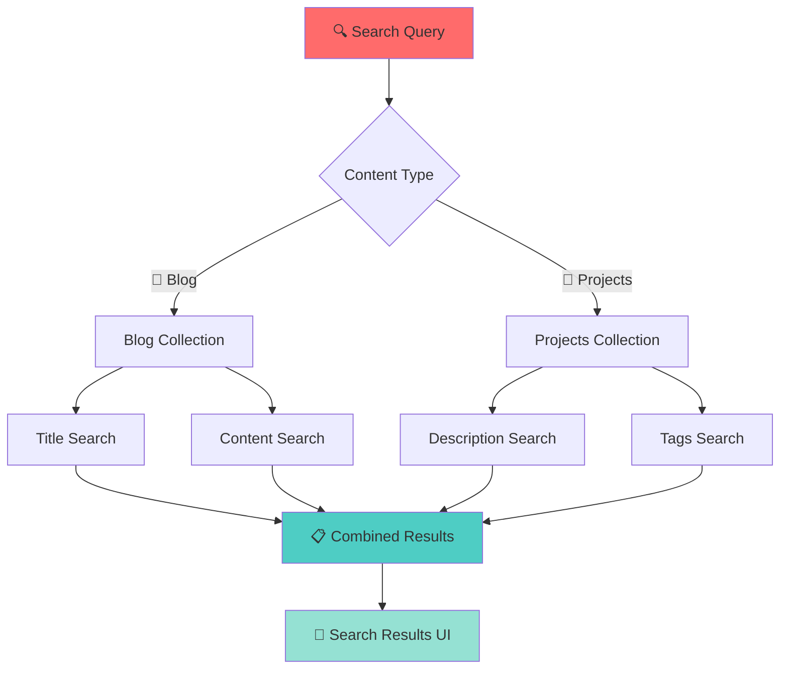

> **💡 What did we learn?** Nuxt Content's query system provides powerful database-like operations directly on your file system, with type safety and performance optimizations built in! The real-world examples show how these queries integrate seamlessly into Vue components. 🎯✨

---

## ✨ Special Features and Advanced Patterns {#special-features}

> **🔥 Unlock the Full Power**: Discover advanced features that transform your content experience from good to extraordinary!

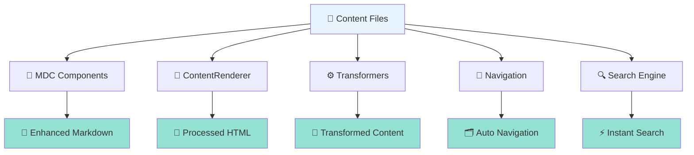

### 🧩 MDC (Markdown Components) {#mdc-markdown-components}

MDC revolutionizes markdown by allowing Vue components directly in your content! 🎨

#### 📝 MDC in Action - About Page (Block 7.1.1)

Looking at our About page implementation:

```vue
<!-- 📍 /app/pages/about.vue - Real MDC Usage -->
<template>
  <UPage v-if="page">
    <UPageHero
      :title="page.title"
      :description="page.description"
      orientation="horizontal"
    >
      <!-- 🎨 Dynamic avatar from app config -->
      <UColorModeAvatar
        class="sm:rotate-4 size-36 rounded-lg ring ring-default ring-offset-3"
        :light="global.picture?.light!"
        :dark="global.picture?.dark!"
        :alt="global.picture?.alt!"
      />
    </UPageHero>
    
    <UPageSection>
      <!-- 🧩 MDC Magic - Renders markdown with Vue components! -->
      <MDC
        :value="page.content"
        unwrap="p"                   <!-- 🎯 Unwrap single paragraphs -->
      />
      
      <!-- 🖼️ Custom component integration -->
      <div class="flex flex-row justify-center items-center py-10 space-x-[-2rem]">
        <PolaroidItem
          v-for="(image, index) in page.images"
          :key="index"
          :image="image"
          :index
        />
      </div>
    </UPageSection>
  </UPage>
</template>
```

#### 📝 MDC Component Usage Examples (Block 7.1.2)

```markdown
<!-- ✍️ In your markdown files, use Vue components directly! -->

# My About Page

This is regular markdown content that gets processed.

::PolaroidItem{image="/photo1.jpg" caption="Team meeting"}
::

You can also use shorthand syntax:

::alert{type="info"}
This creates a beautiful alert component!
::

Or with slots:

::card
#title
Amazing Project

#description
This project showcases the power of MDC components in markdown.
::
```

### 🎨 ContentRenderer Features {#contentrenderer-features}

ContentRenderer is the magic that transforms your markdown into beautiful HTML! ⚡

#### 📝 ContentRenderer Configuration (Block 7.2.1)

```vue
<!-- 🎨 Advanced ContentRenderer usage -->
<template>
  <ContentRenderer
    :value="content"
    :unwrap="['p']"              <!-- 🎯 Unwrap single paragraphs -->
    :components="customComponents" <!-- 🧩 Custom component mapping -->
    class="prose prose-lg"       <!-- 📖 Typography classes -->
  />
</template>

<script setup>
// 🎨 Custom component mapping for enhanced rendering
const customComponents = {
  'code-block': CodeHighlighter,
  'image-gallery': ImageGallery,
  'quote-card': QuoteCard
}
</script>
```

#### 📝 ContentRenderer with Custom Styling (Block 7.2.2)

```vue
<!-- 🎨 Blog post with custom ContentRenderer -->
<template>
  <article class="max-w-4xl mx-auto">
    <ContentRenderer
      :value="post.content"
      :unwrap="false"
      class="
        prose 
        prose-slate 
        prose-lg 
        prose-headings:scroll-mt-24
        prose-img:rounded-lg
        prose-code:bg-slate-100
        prose-pre:bg-slate-900
        dark:prose-invert
      "
    />
  </article>
</template>
```

### ⚙️ Content Transformers {#content-transformers}

Transformers process your content during build time, adding powerful capabilities! 🔧

#### 📝 Built-in Transformers (Block 7.3.1)

```typescript
// 🔧 nuxt.config.ts - Content module configuration
export default defineNuxtConfig({
  content: {
    // 📖 Markdown transformers
    markdown: {
      // 🎨 Syntax highlighting
      rehypePlugins: [
        'rehype-highlight',      // 💡 Code syntax highlighting
        'rehype-slug',          // 🔗 Auto-generate heading IDs
        'rehype-autolink-headings' // 🔗 Clickable heading links
      ],
      
      // 📝 Markdown extensions
      remarkPlugins: [
        'remark-gfm',           // 📋 GitHub Flavored Markdown
        'remark-emoji',         // 😀 Emoji support
        'remark-reading-time'   // ⏱️ Reading time calculation
      ]
    },
    
    // 🔍 Search configuration
    search: {
      indexed: true,            // 🔍 Enable search indexing
      fields: ['title', 'description', 'content']
    }
  }
})
```

#### 📝 Custom Transformer Example (Block 7.3.2)

```typescript
// 📝 Custom transformer for adding reading time
export default defineNuxtConfig({
  content: {
    transformers: {
      // ⏱️ Reading time calculator
      readingTime: {
        wordsPerMinute: 200,    // 📖 Average reading speed
        include: ['*.md'],      // 📝 Only for markdown files
        exclude: ['drafts/**']  // 🚫 Skip draft content
      }
    }
  }
})
```

### 🧭 Navigation Generation {#navigation-generation}

Nuxt Content automatically generates navigation from your content structure! 🗂️

#### 📝 Auto-Generated Navigation (Block 7.4.1)

```vue
<!-- 🧭 Automatic navigation from content structure -->
<template>
  <nav class="sidebar">
    <ul>
      <li v-for="item in navigation" :key="item._path">
        <NuxtLink 
          :to="item._path"
          :class="{ 'active': $route.path === item._path }"
        >
          {{ item.title }}
        </NuxtLink>
        
        <!-- 🌳 Nested navigation for sub-pages -->
        <ul v-if="item.children" class="ml-4">
          <li v-for="child in item.children" :key="child._path">
            <NuxtLink :to="child._path">
              {{ child.title }}
            </NuxtLink>
          </li>
        </ul>
      </li>
    </ul>
  </nav>
</template>

<script setup>
// 🧭 Fetch navigation structure from content
const { data: navigation } = await useAsyncData('navigation', () =>
  queryCollection('navigation').all()
)
</script>
```

#### 📝 Custom Navigation Builder (Block 7.4.2)

```typescript
// 🧭 Build custom navigation from content metadata
const { data: blogNavigation } = await useAsyncData('blog-nav', async () => {
  const posts = await queryCollection('blog')
    .order('date', 'DESC')
    .all()
  
  // 📅 Group by year for timeline navigation
  const groupedByYear = posts.reduce((acc, post) => {
    const year = new Date(post.date).getFullYear()
    if (!acc[year]) acc[year] = []
    acc[year].push(post)
    return acc
  }, {} as Record<number, typeof posts>)
  
  return groupedByYear
})
```

### 🔍 Search Implementation {#search-implementation}

Build powerful search functionality with minimal configuration! ⚡

#### 📝 Client-Side Search (Block 7.5.1)

```vue
<!-- 🔍 Real-time search component -->
<template>
  <div class="search-container">
    <input
      v-model="searchQuery"
      placeholder="Search articles, projects..."
      class="search-input"
      @input="performSearch"
    />
    
    <!-- 📋 Search results -->
    <div v-if="searchResults.length" class="search-results">
      <div
        v-for="result in searchResults"
        :key="result._path"
        class="search-result"
      >
        <NuxtLink :to="result._path">
          <h3>{{ result.title }}</h3>
          <p>{{ result.description }}</p>
          <!-- 🏷️ Content type badge -->
          <span class="badge">{{ result._collection }}</span>
        </NuxtLink>
      </div>
    </div>
  </div>
</template>

<script setup>
const searchQuery = ref('')
const searchResults = ref([])

// 🔍 Debounced search function
const performSearch = useDebounceFn(async () => {
  if (!searchQuery.value) {
    searchResults.value = []
    return
  }
  
  // 🔍 Search across multiple collections
  const [blogs, projects] = await Promise.all([
    queryCollection('blog')
      .where('title', 'contains', searchQuery.value)
      .limit(5)
      .all(),
    queryCollection('projects')
      .where('description', 'contains', searchQuery.value)
      .limit(5)
      .all()
  ])
  
  searchResults.value = [...blogs, ...projects]
}, 300)
</script>
```

#### 📝 Advanced Search with Filtering (Block 7.5.2)

```vue
<!-- 🎛️ Advanced search with filters -->
<template>
  <div class="advanced-search">
    <!-- 🔍 Search input -->
    <input v-model="filters.query" placeholder="Search..." />
    
    <!-- 📋 Content type filter -->
    <select v-model="filters.type">
      <option value="">All Types</option>
      <option value="blog">Blog Posts</option>
      <option value="projects">Projects</option>
    </select>
    
    <!-- 📅 Date range filter -->
    <input v-model="filters.dateFrom" type="date" />
    <input v-model="filters.dateTo" type="date" />
    
    <!-- 🏷️ Tag filter -->
    <div class="tags">
      <label v-for="tag in availableTags" :key="tag">
        <input 
          v-model="filters.tags" 
          :value="tag" 
          type="checkbox"
        />
        {{ tag }}
      </label>
    </div>
  </div>
</template>

<script setup>
const filters = reactive({
  query: '',
  type: '',
  dateFrom: '',
  dateTo: '',
  tags: []
})

// 🔍 Computed search results with multiple filters
const searchResults = computed(() => {
  return performAdvancedSearch(filters)
})
</script>
```

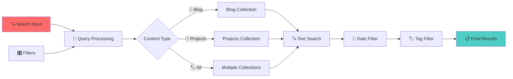

> **💡 What did we learn?** Nuxt Content's special features transform your static files into a dynamic, searchable, and highly interactive content management system with Vue component integration, automatic navigation, and powerful search capabilities! 🚀✨

---

## 🏗️ Content Architecture Summary {#architecture-summary}

> **🎯 The Big Picture**: Understanding how all the pieces work together to create a powerful, maintainable content system!

### 🔄 The Complete Flow {#complete-flow}

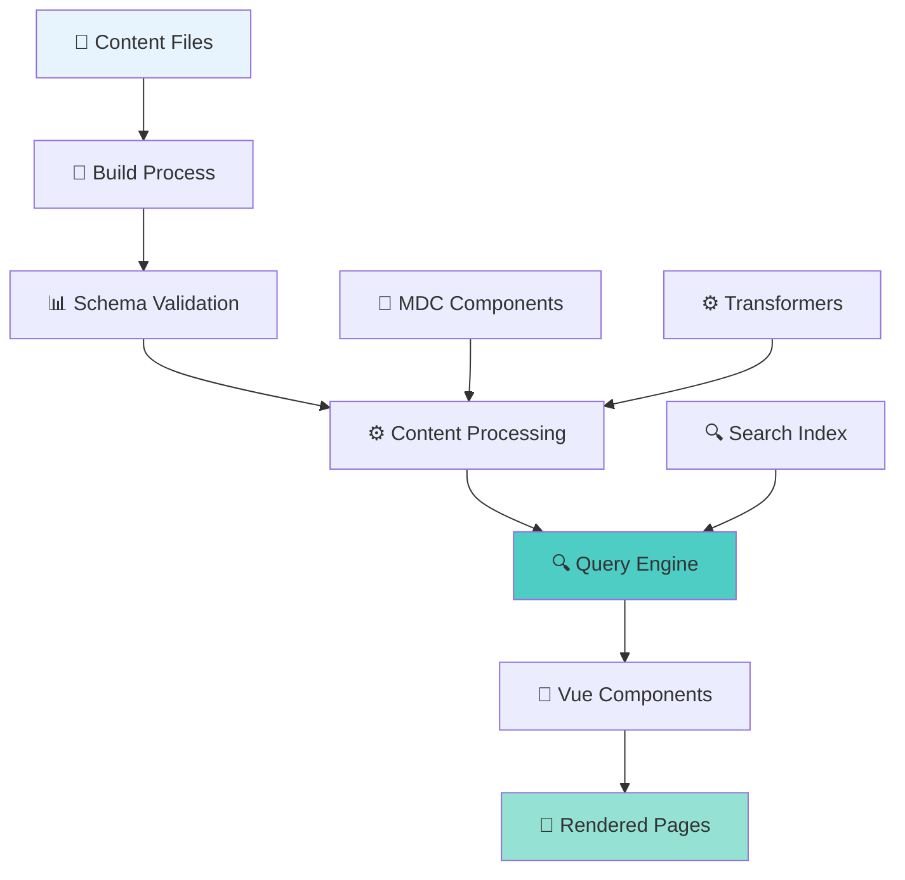

#### 📊 Architecture Flow Breakdown (Block 8.1.1)

| Phase | Process | Technology | Output |
|-------|---------|------------|--------|
| 🎯 **Content Creation** | Write files | YAML/Markdown | Raw content |
| ✅ **Validation** | Type checking | Zod schemas | Validated data |
| 🔧 **Processing** | Transform content | Nuxt Content | Processed objects |
| 🔍 **Querying** | Fetch content | Query engine | Filtered results |
| 🎨 **Rendering** | Display content | Vue templates | HTML pages |

#### 📝 Complete Flow Example (Block 8.1.2)

```typescript
// 🌊 The complete content flow in one component
export default defineNuxtComponent({
  async setup() {
    // 🔍 1. Query content (build-time processing)
    const { data: posts } = await useAsyncData('blog-posts', () =>
      queryCollection('blog')                    // 📁 Target collection
        .where('status', 'published')           // ✅ Filter published
        .order('date', 'DESC')                  // 📅 Sort by date
        .limit(10)                              // 🎯 Limit results
        .all()                                  // 📋 Execute query
    )
    
    // ⚠️ 2. Error handling
    if (!posts.value) {
      throw createError({
        statusCode: 404,
        statusMessage: 'No posts found'
      })
    }
    
    // 🔍 3. SEO configuration from content
    useSeoMeta({
      title: 'My Blog',
      description: 'Latest articles and insights'
    })
    
    return { posts }
  }
})
```

### 🎯 Key Architectural Decisions {#architectural-decisions}

Understanding the "why" behind Nuxt Content's design decisions! 🤔

#### 📋 Design Decision Comparison Table

| Decision | Traditional CMS | Nuxt Content | Why It Matters |
|----------|----------------|--------------|----------------|
| 🗄️ **Data Storage** | Database | File system | 📝 Version control, easy backup |
| ⏱️ **Content Processing** | Runtime | Build-time | ⚡ Better performance |
| 🔒 **Type Safety** | Manual | Automatic | 🛡️ Fewer runtime errors |
| 🚀 **Deployment** | Multi-service | Single artifact | 🎯 Simplified DevOps |
| 🔍 **Querying** | SQL/API | JavaScript | 🧑‍💻 Developer-friendly |

#### 📝 Architectural Benefits (Block 8.2.1)

```typescript
// 🏗️ Benefits demonstrated in code

// ✅ Type Safety - Automatic from your content structure
interface BlogPost {
  title: string
  description: string
  date: string
  featured: boolean
  // 🎯 Types generated automatically from your YAML/Markdown!
}

// ⚡ Performance - No runtime API calls
const posts = await queryCollection('blog').all()  // 🔥 Build-time only!

// 🔍 Developer Experience - Familiar query syntax
const featuredPosts = posts
  .filter(post => post.featured)     // 🎯 JavaScript filtering
  .sort((a, b) => new Date(b.date) - new Date(a.date))  // 📅 JavaScript sorting
```

#### 📝 Content-First Architecture (Block 8.2.2)

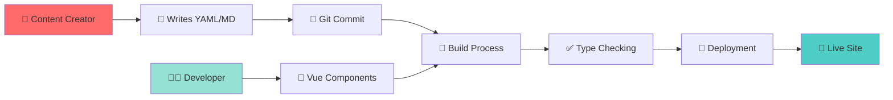

This architecture ensures:
- 📝 **Content creators** work with familiar formats
- 🧑‍💻 **Developers** get type safety and modern tooling  
- 🚀 **Users** experience fast, reliable sites

### 💡 Ideal Use Cases {#ideal-use-cases}

When Nuxt Content shines brightest! ⭐

#### 🎯 Perfect Fit Scenarios (Block 8.3.1)

| Use Case | Why Nuxt Content Excels | Example |
|----------|------------------------|---------|
| 📝 **Developer Portfolios** | Version-controlled content, fast builds | This project! |
| 📚 **Documentation Sites** | File-based organization, search | API docs, guides |
| 📰 **Blog/News Sites** | Markdown workflow, SEO optimization | Tech blogs, company news |
| 🏢 **Company Websites** | Static + dynamic content mix | Landing pages, about pages |
| 📖 **Educational Platforms** | Structured lessons, progress tracking | Courses, tutorials |

#### 📝 Real-World Implementation (Block 8.3.2)

```typescript
// 🎯 This portfolio project showcases ideal patterns:

// 📝 1. Mixed content types
const homepage = await queryCollection('index').first()        // 📊 YAML structure
const blogPosts = await queryCollection('blog').all()         // ✍️ Markdown content
const projects = await queryCollection('projects').all()      // 📋 YAML projects

// 🔍 2. Advanced querying
const featuredContent = await Promise.all([
  queryCollection('blog').where('featured', true).limit(3).all(),
  queryCollection('projects').where('featured', true).limit(3).all()
])

// 🎨 3. Component integration
// Uses Vue components in markdown via MDC
// Renders with ContentRenderer for full control
```

#### 📝 Scalability Considerations (Block 8.3.3)

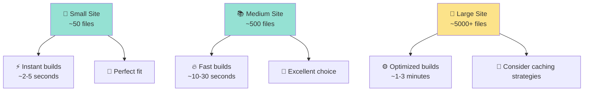

#### 🔧 When to Consider Alternatives (Block 8.3.4)

```typescript
// 🤔 Scenarios where other solutions might be better:

// 🔴 Very large content volumes (10,000+ pages)
// Consider: Hybrid approach with external CMS

// 🔴 Real-time collaborative editing
// Consider: Headless CMS with real-time features

// 🔴 Complex content workflows with approval processes
// Consider: Traditional CMS with workflow management

// 🔴 Non-technical content teams
// Consider: Visual page builders or traditional CMS

// ✅ But for most developer-focused projects:
const perfectFit = {
  fastBuilds: true,
  typeSafety: true,
  versionControl: true,
  developerExperience: 'excellent',
  performance: 'outstanding'
}
```

> **🎉 Final Thoughts**: Nuxt Content represents a paradigm shift from database-driven to file-driven content management, offering developers unprecedented control, type safety, and performance while maintaining simplicity for content creators. It's the perfect bridge between traditional CMS flexibility and modern development practices! 🚀✨

---

## 🎯 Conclusion: Mastering the Content Revolution

> **🏆 You've completed the journey!** From understanding the philosophy to implementing advanced patterns, you now have comprehensive knowledge of Nuxt Content's powerful architecture.

### 🧠 Key Takeaways

- 📁 **File-based beats database-driven** for developer-centric projects
- ⚡ **Build-time processing** delivers superior performance  
- 🛡️ **Automatic type safety** prevents runtime errors
- 🎨 **Vue integration** enables rich, interactive content
- 🔍 **Powerful querying** makes content management intuitive

### 🚀 What's Next?

1. **🛠️ Experiment** with the patterns shown in this guide
2. **📝 Create** your own content collections and queries  
3. **🎨 Build** custom MDC components for your use cases
4. **⚡ Optimize** performance with advanced caching strategies
5. **🌟 Share** your learnings with the community!

**Happy coding with Nuxt Content!** 🎉✨
