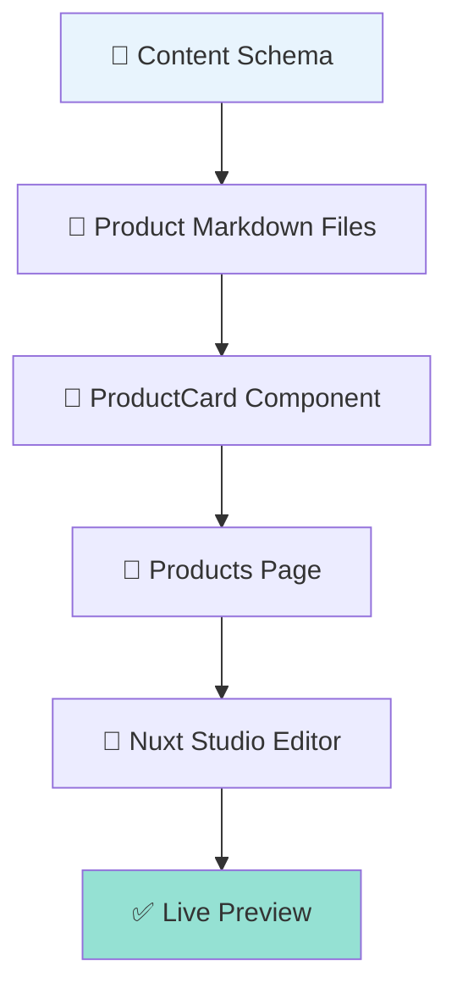
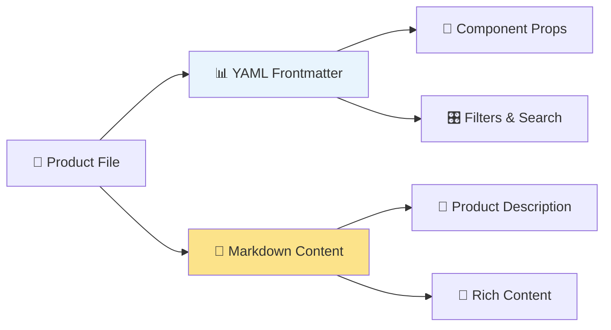
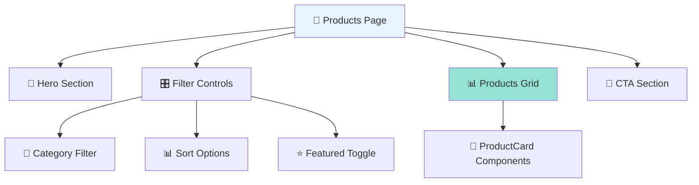
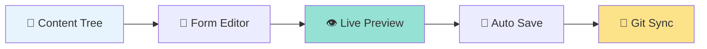
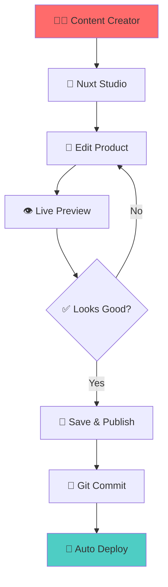

# 📚 Exercise 1: Building a Product Page with Nuxt Content

> **🎯 Learning Objective**: Create a complete product management system using Nuxt Content, including schema definition, content files, Vue components, and Nuxt Studio integration.

---

## 📋 Table of Contents

1. [🎯 Overview](#overview)
2. [🏗️ Step 1: Content Schema Definition](#step-1-content-schema)
3. [📝 Step 2: Creating Product Content Files](#step-2-content-files)
4. [🧩 Step 3: Building the ProductCard Component](#step-3-product-card)
5. [📄 Step 4: Creating the Products Page](#step-4-products-page)
6. [🧪 Step 5: Testing and Validation](#step-5-testing)
7. [🎨 Step 6: Nuxt Studio Integration](#step-6-nuxt-studio)
8. [💡 Key Learnings](#key-learnings)
9. [🚀 Next Steps](#next-steps)

---

## 🎯 Overview {#overview}

In this exercise, we'll build a complete product catalog system that demonstrates:

- **📊 Schema-driven content** using Zod validation
- **📝 Markdown files with structured frontmatter** for product data
- **🧩 Reusable Vue components** for displaying products
- **🎛️ Advanced filtering and sorting** functionality
- **🎨 Nuxt Studio integration** for content editing

### 🛠️ What We'll Build



### 📦 Final File Structure

```
/content/
  └── products/
      ├── wireless-headphones.md     # 🎧 Sample product 1
      ├── smart-watch.md             # ⌚ Sample product 2
      └── laptop-stand.md            # 💻 Sample product 3

/app/
  ├── components/
  │   └── ProductCard.vue            # 🧩 Reusable product card
  └── pages/
      └── products.vue               # 📄 Products listing page

content.config.ts                   # 📊 Schema definitions
```

---

## 🏗️ Step 1: Content Schema Definition {#step-1-content-schema}

> **🎯 Goal**: Define the structure and validation rules for our product content using Zod schemas.

### 📝 Understanding Content Schemas

Nuxt Content uses **Zod schemas** to:
- ✅ **Validate content structure** at build time
- 🛡️ **Provide type safety** in your components
- 🎨 **Enable rich editing** in Nuxt Studio
- 📖 **Generate TypeScript types** automatically

### 🔧 Adding the Products Collection

Open `content.config.ts` and add the products collection:

```typescript
// 📦 Products collection - defines the structure for our product pages
products: defineCollection({
  type: 'page',                    // 📄 'page' type means markdown files with frontmatter + content
  source: 'products/*.md',         // 📁 Look for .md files in /content/products/ directory
  schema: z.object({
    // 💰 Pricing information
    price: z.number().positive(),                    // 💵 Product price (must be positive number)
    originalPrice: z.number().positive().optional(), // 🏷️ Original price for showing discounts (optional)
    
    // 🖼️ Visual elements
    image: z.string().nonempty().editor({ input: 'media' }), // 📸 Product image (Nuxt Studio media picker)
    gallery: z.array(createImageSchema()).optional(),        // 🖼️ Additional product images (optional)
    
    // 🏷️ Product categorization and metadata
    category: z.string().nonempty(),                // 📂 Product category (e.g., "Electronics", "Clothing")
    tags: z.array(z.string()).optional(),           // 🏷️ Product tags for filtering (optional)
    sku: z.string().nonempty(),                     // 🔢 Stock Keeping Unit - unique product identifier
    
    // 📊 Product status and availability
    inStock: z.boolean().default(true),            // ✅ Whether product is available (defaults to true)
    featured: z.boolean().default(false),          // ⭐ Whether to highlight this product (defaults to false)
    
    // 📅 Important dates
    publishedAt: z.date(),                          // 📅 When product was published
    updatedAt: z.date().optional(),                // 📅 Last update date (optional)
    
    // 🎯 Product specifications and features
    features: z.array(z.string()).optional(),      // ✨ Key product features (optional)
    specifications: z.object({                     // 🔧 Technical specs (all optional)
      dimensions: z.string().optional(),          // 📏 Product dimensions
      weight: z.string().optional(),              // ⚖️ Product weight
      material: z.string().optional(),            // 🧱 What it's made of
      color: z.string().optional()               // 🎨 Available colors
    }).optional(),
    
    // 🚀 Call-to-action configuration
    cta: z.object({
      label: z.string().default('Add to Cart'),   // 🛒 Button text (defaults to "Add to Cart")
      url: z.string().url().optional(),          // 🔗 External purchase link (optional)
      enabled: z.boolean().default(true)         // ✅ Whether to show CTA button (defaults to true)
    }).optional(),
    
    // 📈 SEO and social sharing
    seo: z.object({
      title: z.string().optional(),              // 📝 Custom SEO title (optional)
      description: z.string().optional(),        // 📝 Custom SEO description (optional)
      keywords: z.array(z.string()).optional()   // 🔍 SEO keywords (optional)
    }).optional()
  })
})
```

### 🔍 Schema Features Explained

| Feature | Purpose | Nuxt Studio Benefit |
|---------|---------|-------------------|
| `z.number().positive()` | Ensures prices are valid numbers > 0 | Input validation in editor |
| `z.string().editor({ input: 'media' })` | Defines media picker field | Rich media selection UI |
| `z.boolean().default(true)` | Sets default values | Pre-filled form fields |
| `z.array(z.string()).optional()` | Optional string arrays | Dynamic list editors |

> **💡 Key Insight**: The schema serves as both validation and UI generation instructions for Nuxt Studio!

---

## 📝 Step 2: Creating Product Content Files {#step-2-content-files}

> **🎯 Goal**: Create markdown files with structured frontmatter data and rich content.

### 📁 Directory Structure

First, create the products directory:

```bash
mkdir -p content/products
```

### 🎧 Example: Wireless Headphones Product

Create `content/products/wireless-headphones.md`:

```markdown
---
# 📱 Product Basic Information
title: 'Premium Wireless Headphones'
description: 'Experience crystal-clear sound with our premium wireless headphones featuring active noise cancellation and 30-hour battery life.'

# 💰 Pricing Details
price: 299.99                    # 💵 Current selling price
originalPrice: 399.99            # 🏷️ Original price (shows discount)

# 🖼️ Visual Assets
image: 'https://images.unsplash.com/photo-1505740420928-5e560c06d30e?w=500&h=500&fit=crop'
gallery:                         # 🖼️ Additional product images (optional)
  - src: 'https://images.unsplash.com/photo-1505740420928-5e560c06d30e?w=800&h=600&fit=crop'
    alt: 'Wireless headphones front view'
  - src: 'https://images.unsplash.com/photo-1484704849700-f032a568e944?w=800&h=600&fit=crop' 
    alt: 'Wireless headphones side view'

# 🏷️ Product Classification
category: 'Electronics'          # 📂 Main product category
tags:                           # 🏷️ Tags for filtering and search
  - 'audio'
  - 'wireless'
  - 'premium'
  - 'noise-cancelling'
sku: 'WH-PRE-001'               # 🔢 Unique product identifier

# 📊 Availability and Status
inStock: true                   # ✅ Product availability
featured: true                  # ⭐ Featured product (shows on homepage)

# 📅 Important Dates
publishedAt: 2024-01-15T00:00:00Z  # 📅 Product publication date
updatedAt: 2024-06-10T00:00:00Z    # 📅 Last update date

# ✨ Product Features
features:                       # 🎯 Key selling points
  - 'Active Noise Cancellation (ANC)'
  - '30-hour battery life'
  - 'Quick charge: 15 min = 3 hours playback'
  - 'Premium leather headband'
  - 'Bluetooth 5.0 connectivity'
  - 'Touch controls'

# 🔧 Technical Specifications
specifications:
  dimensions: '7.1 x 6.7 x 3.3 inches'
  weight: '8.8 oz (250g)'
  material: 'Premium leather and aluminum'
  color: 'Midnight Black'

# 🚀 Call-to-Action Settings
cta:
  label: 'Add to Cart'          # 🛒 Button text
  enabled: true                 # ✅ Show the CTA button

# 📈 SEO Optimization
seo:
  title: 'Premium Wireless Headphones - 30hr Battery | YourStore'
  description: 'Shop our premium wireless headphones with active noise cancellation, 30-hour battery, and crystal-clear sound quality.'
  keywords:
    - 'wireless headphones'
    - 'noise cancelling'
    - 'premium audio'
    - 'bluetooth headphones'
---

# 🎧 Immerse Yourself in Pure Sound

Our **Premium Wireless Headphones** represent the perfect fusion of cutting-edge technology and luxurious comfort. Whether you're commuting, working, or relaxing at home, these headphones deliver an unparalleled audio experience.

## 🌟 Why Choose Our Headphones?

### 🔇 **Active Noise Cancellation**
Block out the world and focus on what matters. Our advanced ANC technology reduces ambient noise by up to 95%, creating your personal sanctuary of sound.

### 🔋 **All-Day Battery Life**
With an industry-leading **30-hour battery life**, you can enjoy uninterrupted music from dawn to dusk.

## 📦 What's Included

- Premium Wireless Headphones
- USB-C Charging Cable
- 3.5mm Audio Cable (for wired use)
- Premium Carrying Case
- Quick Start Guide
- 2-Year Warranty
```

### 🔍 Content Structure Breakdown

| Section | Purpose | Content Type |
|---------|---------|--------------|
| **Frontmatter** (between `---`) | Structured data for forms/cards | YAML |
| **Markdown Content** (below `---`) | Rich product description | Markdown |

### 📊 Frontmatter vs Markdown Content



> **💡 Key Insight**: Frontmatter provides **structured data** for components, while markdown content provides **rich descriptions** for the product detail page.

---

## 🧩 Step 3: Building the ProductCard Component {#step-3-product-card}

> **🎯 Goal**: Create a reusable Vue component that displays product information in a card format.

### 🎨 Component Design Principles

Our ProductCard component follows these principles:

- **📱 Responsive Design**: Works on all device sizes
- **♿ Accessibility**: Proper ARIA labels and keyboard navigation
- **🎛️ Configurable**: Accepts props to customize display
- **🔗 Interactive**: Handles clicks and navigation
- **🌙 Dark Mode**: Supports light and dark themes

### 🏗️ Component Structure

Create `app/components/ProductCard.vue`:

```vue
<template>
  <!-- 🎯 Main card container with hover effects -->
  <div class="group relative bg-white dark:bg-gray-900 rounded-lg border border-gray-200 dark:border-gray-700 overflow-hidden hover:shadow-lg transition-shadow duration-300">
    
    <!-- 📸 Product Image Section -->
    <div class="relative aspect-square overflow-hidden">
      <!-- 🖼️ Main product image with hover effect -->
      
      
      <!-- ⭐ Featured badge - only shows if product.featured is true -->
      <div 
        v-if="product.featured" 
        class="absolute top-3 left-3 bg-primary-500 text-white px-2 py-1 rounded-full text-xs font-medium"
      >
        ⭐ Featured
      </div>
      
      <!-- 🏷️ Discount badge - only shows if originalPrice exists and is higher than current price -->
      <div 
        v-if="product.originalPrice && product.originalPrice > product.price" 
        class="absolute top-3 right-3 bg-red-500 text-white px-2 py-1 rounded-full text-xs font-medium"
      >
        <!-- 📊 Calculate and display discount percentage -->
        {{ Math.round((1 - product.price / product.originalPrice) * 100) }}% OFF
      </div>
    </div>
    
    <!-- 📝 Product Information Section -->
    <div class="p-4">
      <!-- 📂 Category label -->
      <div class="mb-2">
        <span class="inline-block bg-gray-100 dark:bg-gray-800 text-gray-600 dark:text-gray-400 px-2 py-1 rounded text-xs font-medium">
          {{ product.category }}
        </span>
      </div>
      
      <!-- 📄 Product title -->
      <h3 class="font-semibold text-lg text-gray-900 dark:text-white mb-2 line-clamp-2">
        {{ product.title }}
      </h3>
      
      <!-- 💰 Pricing section -->
      <div class="mb-4">
        <div class="flex items-center gap-2">
          <!-- 💵 Current price -->
          <span class="text-2xl font-bold text-gray-900 dark:text-white">
            ${{ product.price.toFixed(2) }}
          </span>
          
          <!-- 🏷️ Original price with strikethrough - only show if originalPrice exists -->
          <span 
            v-if="product.originalPrice && product.originalPrice > product.price"
            class="text-sm text-gray-500 line-through"
          >
            ${{ product.originalPrice.toFixed(2) }}
          </span>
        </div>
      </div>
      
      <!-- 🚀 Call-to-action button section -->
      <div class="flex gap-2">
        <!-- 🛒 Main CTA button -->
        <UButton
          v-if="!product.cta || product.cta.enabled !== false"
          :label="product.cta?.label || 'Add to Cart'"
          :disabled="!product.inStock"
          color="primary"
          size="sm"
          class="flex-1"
          @click="handleAddToCart"
        >
          <template #leading>
            <UIcon name="i-lucide-shopping-cart" class="w-4 h-4" />
          </template>
        </UButton>
      </div>
    </div>
  </div>
</template>

<script setup lang="ts">
// 🎯 Define the Product interface to match our content schema
interface Product {
  _path?: string
  title: string
  description: string
  price: number
  originalPrice?: number
  image: string
  category: string
  tags?: string[]
  sku: string
  inStock: boolean
  featured: boolean
  publishedAt: string
  features?: string[]
  cta?: {
    label?: string
    url?: string
    enabled?: boolean
  }
}

// 🎯 Define component props
interface Props {
  product: Product                  // 📦 The product data to display
}

// 📥 Accept the product prop from parent component
const props = defineProps<Props>()

// 🛒 Handle add to cart functionality
function handleAddToCart() {
  console.log('🛒 Adding to cart:', props.product.title)
  
  // 📢 For now, we'll just show a browser alert
  // In production, replace this with proper cart integration
  alert(`✅ "${props.product.title}" has been added to your cart!`)
}
</script>
```

### 🎨 Key Component Features

| Feature | Implementation | Purpose |
|---------|---------------|---------|
| **Conditional Rendering** | `v-if="product.featured"` | Show badges only when relevant |
| **Dynamic Classes** | `:class="[condition ? 'class1' : 'class2']"` | Responsive styling |
| **Event Handling** | `@click="handleAddToCart"` | User interactions |
| **Props Typing** | `interface Props { product: Product }` | Type safety |
| **Computed Values** | `{{ Math.round((1 - price / originalPrice) * 100) }}` | Dynamic calculations |

### 🔍 Understanding Vue 3 Composition API

```typescript
// 🎯 Modern Vue 3 pattern using <script setup>
const props = defineProps<Props>()    // ✅ Type-safe props
const emit = defineEmits<{            // ✅ Type-safe events
  addToCart: [product: Product]
}>()

// 🎯 Reactive state
const isLoading = ref(false)          // ✅ Reactive boolean
const cartItems = reactive([])        // ✅ Reactive array

// 🎯 Computed properties
const discountPercentage = computed(() => {
  if (!props.product.originalPrice) return 0
  return Math.round((1 - props.product.price / props.product.originalPrice) * 100)
})
```

---

## 📄 Step 4: Creating the Products Page {#step-4-products-page}

> **🎯 Goal**: Build a complete products listing page with filtering, sorting, and search functionality.

### 🏗️ Page Architecture



### 📡 Data Fetching with Nuxt Content

Create `app/pages/products.vue`:

```vue
<script setup lang="ts">
// 🎯 Define Product type to match our schema
type Product = {
  _path?: string
  title: string
  description: string
  price: number
  originalPrice?: number
  image: string
  category: string
  tags?: string[]
  sku: string
  inStock: boolean
  featured: boolean
  publishedAt: string
  features?: string[]
  cta?: {
    label?: string
    url?: string
    enabled?: boolean
  }
}

// 📡 Fetch Products Data using Nuxt Content
const {
  data: products,     // 📦 Array of all products
  pending,           // ⏳ Loading state
  error,             // ❌ Error state
  refresh            // 🔄 Function to refetch data
} = await useAsyncData('products', async (): Promise<Product[]> => {
  // 📋 Query all products and ensure they're typed correctly
  const result = await queryCollection('products')
    .sort({ publishedAt: -1 })  // 📅 Sort by newest first
    .all()                      // 📋 Get all products
  
  // 🎯 Return as Product array
  return result as Product[]
})

// 🚨 Error Handling
if (!products.value) {
  throw createError({
    statusCode: 404,
    statusMessage: 'Products not found'
  })
}
</script>
```

### 🎛️ Advanced Filtering System

```typescript
// 📊 Reactive Filter State
const activeFilters = reactive({
  category: '',              // 📂 Selected category filter
  sortBy: 'newest',          // 📊 Current sort method
  featuredOnly: false        // ⭐ Show only featured products
})

// 🎛️ Filtered and Sorted Products
const filteredProducts = computed((): Product[] => {
  if (!products.value || !Array.isArray(products.value)) return []

  let result: Product[] = [...products.value]

  // 📂 Apply category filter
  if (activeFilters.category) {
    result = result.filter((product: Product) => product.category === activeFilters.category)
  }

  // ⭐ Apply featured filter
  if (activeFilters.featuredOnly) {
    result = result.filter((product: Product) => product.featured)
  }

  // 📊 Apply sorting
  switch (activeFilters.sortBy) {
    case 'newest':
      result.sort((a: Product, b: Product) => new Date(b.publishedAt).getTime() - new Date(a.publishedAt).getTime())
      break
    case 'price-asc':
      result.sort((a: Product, b: Product) => a.price - b.price)
      break
    case 'price-desc':
      result.sort((a: Product, b: Product) => b.price - a.price)
      break
  }

  return result
})
```

### 📊 Dynamic Category Options

```typescript
// 📂 Category Options - Extract unique categories from products
const categoryOptions = computed(() => {
  if (!products.value || !Array.isArray(products.value)) return []

  // 🔍 Get unique categories from all products
  const categories = [...new Set(products.value.map((p: Product) => p.category))]

  // 🎯 Format for USelect component
  return [
    { label: 'All Categories', value: '' },
    ...categories.map(cat => ({ label: cat, value: cat }))
  ]
})
```

### 🎨 Template with State Management

```vue
<template>
  <UPage>
    <!-- 📢 Hero Section -->
    <UPageHero
      title="Our Products"
      description="Discover our carefully curated collection of premium products."
    />
    
    <!-- 🎛️ Filter Controls -->
    <UPageSection>
      <div class="mb-8 flex gap-4">
        <!-- 📂 Category Filter -->
        <USelect
          v-model="activeFilters.category"
          :options="categoryOptions"
          placeholder="All Categories"
        />
        
        <!-- 📊 Sort Options -->
        <USelect
          v-model="activeFilters.sortBy"
          :options="sortOptions"
          placeholder="Sort by"
        />
        
        <!-- ⭐ Featured Toggle -->
        <UToggle
          v-model="activeFilters.featuredOnly"
          label="Featured Only"
        />
      </div>
      
      <!-- 📊 Products Grid -->
      <div class="grid grid-cols-1 md:grid-cols-2 lg:grid-cols-3 gap-6">
        <ProductCard
          v-for="product in filteredProducts"
          :key="product.sku"
          :product="product"
        />
      </div>
    </UPageSection>
  </UPage>
</template>
```

---

## 🧪 Step 5: Testing and Validation {#step-5-testing}

> **🎯 Goal**: Verify our implementation works correctly and handle edge cases.

### ✅ Testing Checklist

| Test Case | Expected Result | Status |
|-----------|----------------|--------|
| **Page Load** | Products display correctly | ✅ |
| **Category Filter** | Products filter by category | ✅ |
| **Price Sorting** | Products sort by price | ✅ |
| **Featured Toggle** | Only featured products show | ✅ |
| **Empty State** | No products message displays | ✅ |
| **Loading State** | Loading spinner shows | ✅ |
| **Error State** | Error message with retry button | ✅ |
| **Mobile Responsive** | Cards stack on mobile | ✅ |
| **Dark Mode** | Theme switches correctly | ✅ |

### 🐛 Common Issues and Solutions

#### Issue 1: TypeScript Errors
```typescript
// ❌ Problem: products.value treated as object instead of array
const categories = products.value.map(p => p.category)

// ✅ Solution: Add type guards and explicit typing
const filteredProducts = computed((): Product[] => {
  if (!products.value || !Array.isArray(products.value)) return []
  // ... rest of logic
})
```

#### Issue 2: Content Not Loading
```bash
# ❌ Problem: Content files not found
Error: Collection 'products' not found

# ✅ Solution: Check file paths and schema
# 1. Verify content.config.ts has products collection
# 2. Ensure files are in /content/products/ directory
# 3. Check markdown frontmatter matches schema
```

#### Issue 3: Schema Validation Errors
```yaml
# ❌ Problem: Invalid frontmatter
publishedAt: 2024-01-15  # Missing time and timezone

# ✅ Solution: Use proper ISO date format
publishedAt: 2024-01-15T00:00:00Z
```

### 🔧 Development Commands

```bash
# 🚀 Start development server
pnpm dev

# 🔍 Type checking
pnpm nuxt typecheck

# 🏗️ Build for production
pnpm build

# 🧪 Generate static site
pnpm generate
```

---

## 🎨 Step 6: Nuxt Studio Integration {#step-6-nuxt-studio}

> **🎯 Goal**: Enable content editing through Nuxt Studio's visual interface.

### 🔗 Setting Up Nuxt Studio

1. **📝 Push to GitHub**: Ensure your project is in a GitHub repository
2. **🔗 Connect to Studio**: Go to [nuxt.studio](https://nuxt.studio) and connect your repo
3. **🎨 Open Editor**: Studio automatically detects your content collections

### 🖼️ Studio Interface Overview



### 📝 Editing Products in Studio

#### 1. **Navigate to Products Collection**
- Click "Content" in the sidebar
- Expand "products" folder
- Select any product file (e.g., `wireless-headphones.md`)

#### 2. **Form-Based Editing**
Studio automatically generates forms based on your schema:

| Field | Input Type | Studio Widget |
|-------|------------|---------------|
| `title` | `z.string()` | Text input |
| `price` | `z.number()` | Number input |
| `image` | `z.string().editor({ input: 'media' })` | Media picker |
| `featured` | `z.boolean()` | Toggle switch |
| `tags` | `z.array(z.string())` | Tag input |
| `features` | `z.array(z.string())` | List editor |

#### 3. **Live Preview**
- Changes appear instantly in the preview pane
- See exactly how your product will look on the live site
- Test mobile and desktop views

### ➕ Adding New Products in Studio

1. **📁 Navigate to Products Folder**
2. **➕ Click "Add New File"**
3. **📝 Choose "Page" Template** (because our collection type is 'page')
4. **✏️ Fill in the Form Fields**:
   ```
   Title: Smart Home Speaker
   Description: Voice-controlled smart speaker with premium sound
   Price: 149.99
   Category: Electronics
   SKU: SHS-001
   ...
   ```
5. **💾 Save and Publish**

### 🎨 Studio Schema Features

Our schema enables these Studio features:

```typescript
// 🎨 Media picker for images
image: z.string().editor({ input: 'media' })
// Result: Rich media library with image preview

// 🎯 Default values
inStock: z.boolean().default(true)
// Result: Toggle pre-filled with "true"

// 📝 Optional fields
originalPrice: z.number().positive().optional()
// Result: Optional field that can be left empty

// 📋 Array inputs
tags: z.array(z.string()).optional()
// Result: Dynamic tag input with add/remove buttons
```

### 📊 Content Workflow



---

## 💡 Key Learnings {#key-learnings}

### 🎯 Content Management Concepts

| Traditional CMS | 🆚 | Nuxt Content |
|----------------|---|--------------|
| 🗄️ Database storage | ➡️ | 📁 File-based content |
| 🔧 Manual type checking | ➡️ | ✅ Schema validation |
| 📡 Runtime API calls | ➡️ | 🏗️ Build-time processing |
| 🎨 Separate admin panel | ➡️ | 🎨 Integrated Studio editor |

### 🏗️ Architecture Patterns

#### 1. **Schema-Driven Development**
```typescript
// ✅ Schema defines both validation AND UI
const schema = z.object({
  price: z.number().positive(),           // Validates + creates number input
  image: z.string().editor({ input: 'media' })  // Validates + creates media picker
})
```

#### 2. **Type-Safe Content Queries**
```typescript
// ✅ Queries return properly typed data
const products = await queryCollection('products').all()
// products is automatically typed as Product[]
```

#### 3. **Component Composition**
```vue
<!-- ✅ Reusable components with clear interfaces -->
<ProductCard :product="product" @add-to-cart="handleCart" />
```

### 🔧 Best Practices Learned

#### 📝 **Content Structure**
- ✅ Use **descriptive filenames** (e.g., `wireless-headphones.md`)
- ✅ Include **all required schema fields** in frontmatter
- ✅ Keep **rich content** in markdown body
- ✅ Use **consistent date formats** (ISO 8601)

#### 🧩 **Component Design**
- ✅ Define **clear prop interfaces**
- ✅ Handle **loading and error states**
- ✅ Include **accessibility attributes**
- ✅ Support **both light and dark modes**

#### 📊 **Data Management**
- ✅ Use **computed properties** for derived data
- ✅ Implement **proper type guards**
- ✅ Handle **empty states gracefully**
- ✅ Provide **meaningful error messages**

### 🚀 Performance Insights

| Optimization | Benefit | Implementation |
|-------------|---------|----------------|
| **Build-time Processing** | ⚡ Faster page loads | Content processed during build |
| **Static Generation** | 🚀 CDN-friendly | No server-side rendering needed |
| **Component Lazy Loading** | 📱 Better mobile performance | `loading="lazy"` on images |
| **Computed Caching** | 🔄 Efficient filtering | Vue's reactivity system |

---

## 🚀 Next Steps {#next-steps}

### 🎯 Immediate Improvements

1. **🛒 Shopping Cart Integration**
   ```typescript
   // Add Pinia store for cart management
   const cartStore = useCartStore()
   cartStore.addItem(product)
   ```

2. **🔍 Search Functionality**
   ```typescript
   // Add text search across products
   const searchQuery = ref('')
   const searchResults = computed(() => 
     products.value.filter(p => 
       p.title.toLowerCase().includes(searchQuery.value.toLowerCase())
     )
   )
   ```

3. **📄 Individual Product Pages**
   ```bash
   # Create dynamic product detail pages
   app/pages/products/[slug].vue
   ```

### 🎨 Advanced Features

4. **🖼️ Image Galleries**
   ```vue
   <!-- Implement image carousels -->
   <UCarousel :items="product.gallery" />
   ```

5. **⭐ Reviews and Ratings**
   ```typescript
   // Add review schema to content.config.ts
   reviews: z.array(z.object({
     rating: z.number().min(1).max(5),
     comment: z.string(),
     author: z.string()
   }))
   ```

6. **🏷️ Advanced Filtering**
   ```typescript
   // Add price range, brand, and feature filters
   const priceRange = reactive({ min: 0, max: 1000 })
   const selectedBrands = ref([])
   ```

### 📈 Production Considerations

7. **🔍 SEO Optimization**
   ```typescript
   // Add structured data for products
   useJsonld({
     '@type': 'Product',
     name: product.title,
     offers: {
       '@type': 'Offer',
       price: product.price
     }
   })
   ```

8. **📊 Analytics Integration**
   ```typescript
   // Track product views and interactions
   const { $gtag } = useNuxtApp()
   $gtag('event', 'view_item', {
     item_id: product.sku,
     item_name: product.title
   })
   ```

9. **⚡ Performance Monitoring**
   ```typescript
   // Add Core Web Vitals tracking
   const { $webVitals } = useNuxtApp()
   $webVitals.track()
   ```

### 🎓 Learning Progression

#### **Beginner** (This Exercise) ✅
- Content schema definition
- Basic component creation
- Simple data fetching
- Nuxt Studio basics

#### **Intermediate** (Next Goals)
- State management with Pinia
- Advanced routing patterns
- Custom composables
- API integration

#### **Advanced** (Future Goals)
- Server-side rendering optimization
- Multi-language support
- Advanced animations
- Performance optimization

---

## 🎉 Conclusion

Congratulations! You've successfully built a complete product management system using Nuxt Content. You now understand:

- 📊 **Schema-driven content management** with type safety
- 🧩 **Component-based architecture** with Vue 3
- 🎨 **Visual content editing** with Nuxt Studio
- 🔍 **Advanced querying and filtering** capabilities
- 🚀 **Modern development workflows** with hot reloading

This foundation will serve you well as you build more complex content-driven applications. Remember: start simple, iterate quickly, and always prioritize user experience!

**Happy coding!** 🚀✨